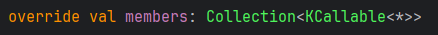
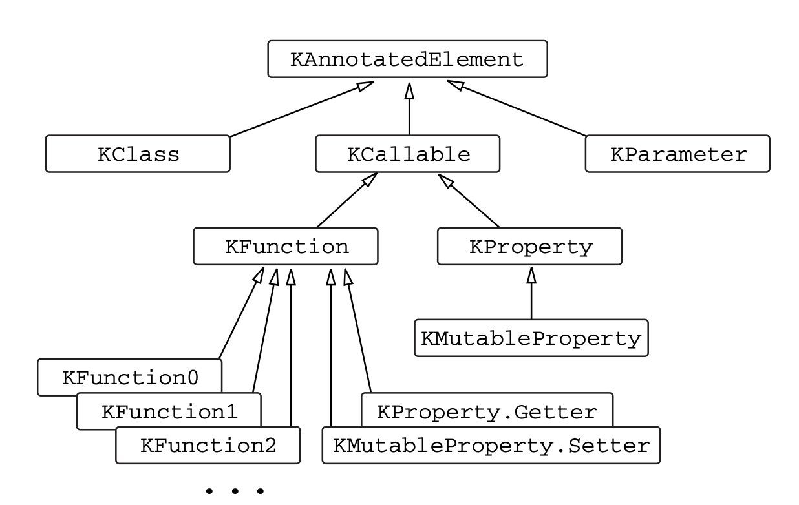
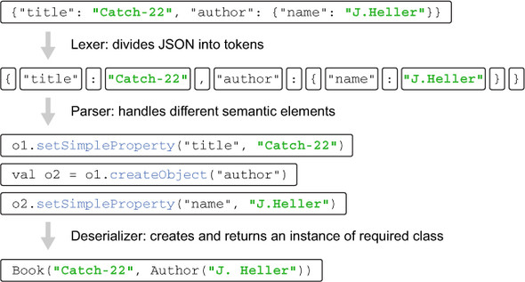

# 10.2 리플렉션: 실행 시점에 코틀린 객체 내부 관찰
리플렉션 : 실행 시점에 동적으로 객체의 프로퍼티와 메서드에 접근할 수 있게 해주는 방법

보통은 미리 선언되어 있는 프로퍼티나 메서드를 사용하기 때문에 컴파일 시점에 정적으로 찾아내어 실제로 존재함이 보장됨<br>
하지만 실행시점에만 알 수 있는 경우가 있음.(JSON 직렬화 라이브러리)
> 직렬화 라이브러리는 어떤 객체든 JSON으로 변환할 수 있어야 하고,<br>
> 실행 시점이 되기 전까지 라이브러리가 직렬화할 프로퍼티나 클래스에 대한 정보를 알 수 없음<br>
> => 이럴때 리플렉션 사용

#### 리플렉션 API 2가지
- java.lang.reflect 패키지를 통한 리플렉션
- kotlin.reflect 패키지를 통한 리플렉션<br>
    이 API는 자바에는 없는 프로퍼티나 널이 될 수 있는 타입 등 코틀린 고유개념에 대한 리플렉션 제공

> 코틀린 리플렉션은 자바 리플렉션 API를 완전히 대체하지는 못하기 때문에 <br>자바 리플렉션을 대안으로 사용해야하는 경우가 있음

```gradle
// 리플렉션이 처음에 안되면 이거 build.gradle에 추가
implementation "org.jetbrains.kotlin:kotlin-reflect:1.8.0"
```

<br>

## 10.2.1 코틀린 리플렉션 API: KClass, KCallable, KFunction, KProperty

java.lang.Class == KClass ==  java.lang.Object.getClass()<br>
``MyClass::class`` 라는 식을 쓰면 KClass 인스턴스를 얻을 수 있음<br>
.kotlin 확장 프로퍼티를 통해 자바에서 코틀린 리플렉션 API로 옮겨 올 수 있음
```kt
class Person(val name:String, val age:Int)

fun main() {
    val person = Person("Alice", 29)
    val kClass = person.javaClass.kotlin
    println(kClass.simpleName)
    kClass.members.forEach { println(it.name) }
}
```
```
Person
age
name
equals
hashCode
toString
```

KClass 에 대해 사용할 수 있는 다양한 기능은 kotlin-reflect 라이브러리를 통해 제공하는 확장함수임<br>
``members``로 가져오는 KClass 의 모든 멤버의 목록이 KCallable 인걸 알 수 있음
<br>
KCallable 은 함수와 프로퍼티를 아우르는 공통 상위 인터페이스임<br>
이 안에 있는 ``call`` 메서드가 프로퍼티의 ``getter`` 를 호출함
```kt
public fun call(vararg args: Any?): R
```
``call``을 사용할 대는 함수 인자를 vararg 리스트로 전달함
```kt
fun foo(x:Int) = println(x)
val kFunction = ::foo
kFunction.call(42)
```
``call``에 넘긴 인자 개수와 원래 함수에 정의된 파라미터 개수가 맞아 떨어져야함

``call``메서드는 모든 타입의 함수에 적용할 수 있는 일반적인 메서드지만 타입 안전성을 보장해주지는 않음

``call``을 통해서 프로퍼티의 게터를 호출할 수 있음<br>
프로퍼티 값을 얻는 더 좋은 방법으로 ``get``이 있음
```kt
var counter = 0
fun main(){
    val kProperty = ::counter
    kProperty.setter.call(42)
    println(kProperty.get())
}
```
```
42
```
멤버 프로퍼티는 KProperty1 인스턴스로 표현됨

최상위 수준이나 클래스 안에 정의된 프로퍼티만 리플렉션으로 접근할 수 있고<br>
함수의 로컬변수에는 접근할 수 없음

<br>
코틀린 리플렉션 API의 인터페이스 계층 구조

<br>

## 10.2.2 리플렉션을 사용한 객체 직렬화 구현
JKid 라이브러리를 예시로 직렬화 구현 확인

> <details>
>     <summary>JKid 환경설정</summary>
>   <ul>
>       <li><a href="https://github.com/yole/jkid">깃허브 들어가서 코드 받기</a></li>
>       <li>build.gradle 에 설정 추가<pre>sourceSets {
>     main {
>         java {
>             srcDir("JKid 프로젝트를 놓은 경로")
>         }
>     }
> }</pre></li>
>       <li>그래들 sync 맞추고 사용</li>
>   </ul>
> </details>
```kt
// JKid의 직렬화 함수선언부
fun serialize(obj: Any): String

// 사용 부분
class Person1(val name:String, val age:Int)
fun main() {
    val person1 = Person1("Alice", 30)
    val json = serialize(person1)
    println(json)
}
```
```kt
{"age": 30, "name": "Alice"}
```

``serialize`` 는 객체를 받아서 그 객체에 대한 JSON 표현을 문자열로 돌려줌
```kt
// serialize 구현부
fun serialize(obj: Any): String = buildString { serializeObject(obj) }

private fun StringBuilder.serializeObject(obj: Any) {
    obj.javaClass.kotlin.memberProperties
            .filter { it.findAnnotation<JsonExclude>() == null }
            .joinToStringBuilder(this, prefix = "{", postfix = "}") {
                serializeProperty(it, obj)
            }
}

private fun StringBuilder.serializeProperty(
        prop: KProperty1<Any, *>, obj: Any
) {
    val jsonNameAnn = prop.findAnnotation<JsonName>()
    val propName = jsonNameAnn?.name ?: prop.name
    serializeString(propName)
    append(": ")

    val value = prop.get(obj)
    val jsonValue = prop.getSerializer()?.toJsonValue(value) ?: value
    serializePropertyValue(jsonValue)
}

private fun StringBuilder.serializeString(s: String) {
    append('\"')
    s.forEach { append(it.escape()) }
    append('\"')
}

private fun StringBuilder.serializePropertyValue(value: Any?) {
    when (value) {
        null -> append("null")
        is String -> serializeString(value)
        is Number, is Boolean -> append(value.toString())
        is List<*> -> serializeList(value)
        else -> serializeObject(value)
    }
}
```
위 구현은 리플렉션 API를 실전에서 어떻게 사용하는지 보여주는 좋은 예임

<br>

## 10.2.3 어노테이션을 활용한 직렬화 제어

- @JsonExclude : 직렬화 시 제외하고 싶을때 사용
    ```kt
    obj.javaClass.kotlin.memberProperties
            .filter { it.findAnnotation<JsonExclude>() == null }
    ```
- @JsonName : 직렬화 시 JSON에 넣을 이름
    ```kt
    val jsonNameAnn = prop.findAnnotation<JsonName>()
    val propName = jsonNameAnn?.name ?: prop.name
    ```

#### @CustomSerializer 구현
```kt
// @CustomSerializer 구현부
@Target(AnnotationTarget.PROPERTY)
annotation class CustomSerializer(val serializerClass: KClass<out ValueSerializer<*>>)

// 사용
data class Peaple(
    val name:String,
    @CustomSerializer(DateSerializer::class) val birthDate:Date
)
```
```kt
// @CustomSerializer 를 이용하여 직렬화기 가져오기
fun KProperty<*>.getSerializer(): ValueSerializer<Any?>? {
    val customSerializerAnn = findAnnotation<CustomSerializer>() ?: return null
    val serializerClass = customSerializerAnn.serializerClass

    val valueSerializer = serializerClass.objectInstance
            ?: serializerClass.createInstance()
    @Suppress("UNCHECKED_CAST")
    return valueSerializer as ValueSerializer<Any?>
}
```
> ``getSerializer``가 주로 다루는 객체가 KProperty 이기 때문에 KProperty의 확장함수로 정의
```kt
object DateSerializer : ValueSerializer<Date> {
    private val dateFormat = SimpleDateFormat("dd-mm-yyyy")

    override fun toJsonValue(value: Date): Any? =
            dateFormat.format(value)

    override fun fromJsonValue(jsonValue: Any?): Date =
            dateFormat.parse(jsonValue as String)
}
```

<br>

## 10.2.4 파싱과 객체 역직렬화

JKid 라이브러리의 역직렬화 로직을 살펴보자
```kt
// 역직렬화 함수
inline fun <reified T: Any> deserialize(json: String): T

// 사용
data class Author(val name:String)
data class Book(val title:String, val author:Author)

fun main() {
    val json = """{"title":"Catch-22", "author": {"name":"J.Heller"}}"""
    println(json)
    val book = deserialize<Book>(json)
    println(book)
}
```
```
{"title":"Catch-22", "author": {"name":"J.Heller"}}
Book(title=Catch-22, author=Author(name=J.Heller))
```
역직렬화할 객체의 타입을 실체화한 타입 파라미터로 ``deserialize`` 함수에 넘겨 새로운 객체 인스턴스를 얻음

#### 흔한 JSON 역직렬화 3단계
1. 어휘 분석기(lexical analyzer)(렉서, lexer)<br>
    문자열을 토큰(token)의 리스트로 변환<br>
    문자 토큰과 값 토큰으로 분리함
2. 문법 분석기(syntax analyzer)(파서, parser)<br>
    토큰의 리스트를 구조화된 표현으로 변환<br>
    의미 단위로 변환(키-값 등등)
    ```kt
    // JSON 파서 콜백 인터페이스
    interface JsonObject {
        fun setSimpleProperty(propertyName: String, value: Any?)

        fun createObject(propertyName: String): JsonObject

        fun createArray(propertyName: String): JsonObject
    }
    ```
3. 역직렬화 컴포넌트



```kt
// 복잡한 구조를 역직렬화 하기위한 인터페이스
// 이 인터페이스를 지정받은 ObjectSeed, ObjectListSeed, ValueListSeed 가 있음
interface Seed: JsonObject {
    val classInfoCache: ClassInfoCache

    fun spawn(): Any?

    fun createCompositeProperty(propertyName: String, isList: Boolean): JsonObject

    override fun createObject(propertyName: String) = createCompositeProperty(propertyName, false)

    override fun createArray(propertyName: String) = createCompositeProperty(propertyName, true)
}
```

``spawn`` 은 만들어낸 객체를 돌려주는 메서드

```kt
fun <T: Any> deserialize(json: Reader, targetClass: KClass<T>): T {
    // 직렬화할 객체의 프로퍼티를 담을 ObjectSeed 생성
    // ClassInfoCache는 클래스의 프로퍼티에 대한 정보를 저장하는 캐시
    val seed = ObjectSeed(targetClass, ClassInfoCache())
    // 파싱
    Parser(json, seed).parse()
    // 결과 객체 생성
    return seed.spawn()
}
```

```kt
class ObjectSeed<out T: Any>(
        targetClass: KClass<T>,
        override val classInfoCache: ClassInfoCache
) : Seed {

    private val classInfo: ClassInfo<T> = classInfoCache[targetClass]

    private val valueArguments = mutableMapOf<KParameter, Any?>()
    private val seedArguments = mutableMapOf<KParameter, Seed>()

    private val arguments: Map<KParameter, Any?>
        get() = valueArguments + seedArguments.mapValues { it.value.spawn() }

    override fun setSimpleProperty(propertyName: String, value: Any?) {
        val param = classInfo.getConstructorParameter(propertyName)
        valueArguments[param] = classInfo.deserializeConstructorArgument(param, value)
    }

    override fun createCompositeProperty(propertyName: String, isList: Boolean): Seed {
        val param = classInfo.getConstructorParameter(propertyName)
        val deserializeAs = classInfo.getDeserializeClass(propertyName)
        val seed = createSeedForType(
                deserializeAs ?: param.type.javaType, isList)
        return seed.apply { seedArguments[param] = this }
    }

    override fun spawn(): T = classInfo.createInstance(arguments)
}
```

<br>

## 10.2.5 최종 역직렬화 단계: callBy(), 리플렉션을 사용해 객체만들기

ClassInfo 클래스를 이해해보자

```kt
// 먼저 알고 넘어갈 API를 보자
// call은 디폴트 파라미터를 값을 지원하지 않음
public actual interface KCallable<out R> : KAnnotatedElement {
    // callBy는 디폴트 파라미터 값을 지원함
    // 건네받은 map의 key에 파라미터가 없고 파라미터 디폴트 값이 정의돼 있으면 디폴트 값 사용
    public fun callBy(args: Map<KParameter, Any?>): R
}
```
위 방법은 파라미터 순서를 지킬 필요가 없어서 좋음<br>
값의 타입과 파라미터의 타입을 생성자의 파라미터 타입과 일치시켜야함<br>
(KPrameter.type 을 사용하면 파라미터의 타입을 알 수 있음)

타입 변환에는 직렬화에 사용했던 함수를 그대로 사용
```kt
fun serializerForType(type: Type): ValueSerializer<out Any?>? =
    when (type) {
        Byte::class.java, Byte::class.javaObjectType -> ByteSerializer
        Short::class.java, Short::class.javaObjectType -> ShortSerializer
        Int::class.java, Int::class.javaObjectType -> IntSerializer
        Long::class.java, Long::class.javaObjectType -> LongSerializer
        Float::class.java, Float::class.javaObjectType -> FloatSerializer
        Double::class.java, Double::class.javaObjectType -> DoubleSerializer
        Boolean::class.java, Boolean::class.javaObjectType -> BooleanSerializer
        String::class.java -> StringSerializer
        else -> null
    }
```

ClassInfoCache는 리플렉션 연산 비용을 줄이기 위한 클래스임
```kt
class ClassInfoCache {
    private val cacheData = mutableMapOf<KClass<*>, ClassInfo<*>>()

    @Suppress("UNCHECKED_CAST")
    operator fun <T : Any> get(cls: KClass<T>): ClassInfo<T> =
            cacheData.getOrPut(cls) { ClassInfo(cls) } as ClassInfo<T>
}
```
객체를 역직렬화할 때는 프로퍼티가 아니라 생성자 파라미터를 다뤄야함<br>
=> 어노테이션을 꺼내려면 파라미터에 해당하는 프로퍼티를 찾아야됨<br>
=> 클래스 별로 한번만 검색을 수행하고 캐시에 넣어둬서 성능 개선

```kt
class ClassInfo<T : Any>(cls: KClass<T>) {
    private val className = cls.qualifiedName
    private val constructor = cls.primaryConstructor
            ?: throw JKidException("Class ${cls.qualifiedName} doesn't have a primary constructor")

    private val jsonNameToParamMap = hashMapOf<String, KParameter>()
    private val paramToSerializerMap = hashMapOf<KParameter, ValueSerializer<out Any?>>()
    private val jsonNameToDeserializeClassMap = hashMapOf<String, Class<out Any>?>()

    init { // ***
        constructor.parameters.forEach { cacheDataForParameter(cls, it) }
    }
    // ***
    private fun cacheDataForParameter(cls: KClass<*>, param: KParameter) {
        val paramName = param.name
                ?: throw JKidException("Class $className has constructor parameter without name")

        val property = cls.declaredMemberProperties.find { it.name == paramName } ?: return
        val name = property.findAnnotation<JsonName>()?.name ?: paramName
        jsonNameToParamMap[name] = param

        val deserializeClass = property.findAnnotation<DeserializeInterface>()?.targetClass?.java
        jsonNameToDeserializeClassMap[name] = deserializeClass

        val valueSerializer = property.getSerializer()
                ?: serializerForType(param.type.javaType)
                ?: return
        paramToSerializerMap[param] = valueSerializer
    }

    fun getConstructorParameter(propertyName: String): KParameter = jsonNameToParamMap[propertyName]
            ?: throw JKidException("Constructor parameter $propertyName is not found for class $className")

    fun getDeserializeClass(propertyName: String) = jsonNameToDeserializeClassMap[propertyName]

    fun deserializeConstructorArgument(param: KParameter, value: Any?): Any? {
        val serializer = paramToSerializerMap[param]
        if (serializer != null) return serializer.fromJsonValue(value)

        validateArgumentType(param, value)
        return value
    }

    private fun validateArgumentType(param: KParameter, value: Any?) {
        if (value == null && !param.type.isMarkedNullable) {
            throw JKidException("Received null value for non-null parameter ${param.name}")
        }
        if (value != null && value.javaClass != param.type.javaType) {
            throw JKidException("Type mismatch for parameter ${param.name}: " +
                    "expected ${param.type.javaType}, found ${value.javaClass}")
        }
    }
    // ***
    fun createInstance(arguments: Map<KParameter, Any?>): T {
        ensureAllParametersPresent(arguments)
        return constructor.callBy(arguments)
    }
    // ***
    private fun ensureAllParametersPresent(arguments: Map<KParameter, Any?>) {
        for (param in constructor.parameters) {
            if (arguments[param] == null && !param.isOptional && !param.type.isMarkedNullable) {
                throw JKidException("Missing value for parameter ${param.name}")
            }
        }
    }
}
```
ClassInfo 는 대상 클래스의 새 인스턴스를 만들고 필요한 정보는 캐시해둠