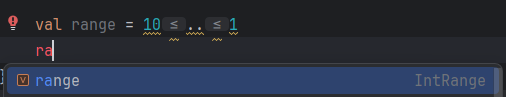
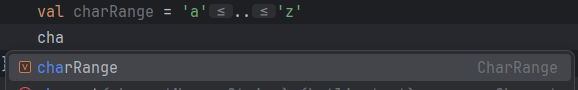

# 2.4 대상을 이터레이션: while과 for 루프

while은 자바와 동일하고 for는 자바의 for-each 에 해당하는 형태만 존재

## 2.4.1 while 루프

while 과 do-while 문이 있음
```kotlin
while (조건){ // 조건이 참인 동안 반복실행
    /* ... */
}

do{
    /* ... */
}while (조건) // 본문을 한번 실행 후 조건이 참인 동안 반복실행
```

<br>

## 2.4.2 수에 대한 이터레이션: 범위와 수열

자바의 초기값, 판단식, 증감식을 사용하는 for문을 대체하기 위해 범위를 사용

``..`` 연산자로 시작 값과 끝 값을 정해서 범위를 만듬
```kt
val oneToTen = 1..10
```
코틀린에서의 범위는 폐구간으로 양끝을 포함하는 구간임

수열(progression) : 범위에 속한 값을 일정한 순서로 이터레이션 하는 경우

```kt
fun fizzBuzz(i:Int) = when {
    i % 15 == 0 -> "FizzBuzz "
    i % 3 == 0 -> "Fizz "
    i % 5 == 0 -> "Buzz "
    else -> "$i "
}

for (i in 1..100){
    println(fizzBuzz(i))
}

for (i in 100 downTo 1 step 2) {
    print(fizzBuzz(i))
}
```
> downTo : 역방향 수열 생성 키워드<br>
> step : 증가값

```kt
for (i in 0 until 10) {
    print("$i ")
}
```
> until : 끝 값을 제외한 범위 생성


<br>

## 2.4.3 맵에 대한 이터레이션
```kt
val binaryReps = TreeMap<Char, String>() // 키 정렬을 위한 TreeMap 사용

for (c in 'A'..'F'){ // 'A' ~ 'F' 까지 문자 범위 이터레이션
    val binary = Integer.toBinaryString(c.toInt()) // 아스키 코드를 2진표현으로 변경
    //get 과 put 대신 [key]로 사용 가능
    binaryReps[c] = binary // c를 키로 c의 2진 표현을 맵에 넣음
}

for ((letter, binary) in binaryReps){ // 구조분해 문법은 7.4.1에서
    println("$letter = $binary")
}
```
```
A = 1000001
B = 1000010
C = 1000011
D = 1000100
E = 1000101
F = 1000110
```

구조분해 구문은 맵이 아닌 컬렉션에도 사용가능
```kt
val list = arrayListOf("10", "11", "1001")
for ((index, element) in list.withIndex()){ // 인덱스와 함께 컬렉션을 이터레이션
    println("$index: $element")
}
```
```
0: 10
1: 11
2: 1001
```
``withIndex`` 는 3장에서 자세히

<br>

## 2.4.4 in으로 컬렉션이나 범위의 원소 검사
``in``연산자로 어떤 값이 범위에 속하는지 검사 가능<br>
``!in``으로 속하지 않는 지 검사 가능

```kt
fun isLetter(c:Char) = c in 'a'..'z' || c in 'A' .. 'Z'
fun isNotDigit(c:Char) = c !in '0'..'9'

println(isLetter('q'))
println(isNotDigit('x'))
```
```
true
true
```

when 식으로 변환
```kt
fun recognize(c:Char) = when (c) {
    in '0' .. '9' -> "It`s a digit!"
    in 'a'..'z', in 'A'.. 'Z' -> "It`s a letter!"
    else -> "I don`t know..."
}

println(recognize('8'))
```
```
It`s a digit!
```

범위는 비교가 가능한 클래스(java.lang.Comparable을 구현한 클래스)라면 그 클래스의 객체를 사용해 범위를 만들 수 있음<br>
Comparable을 사용하는 범위을 경우 그 범위 내의 모든 객체를 항상 이터레이션 하지는 못함<br>
하지만 ``in``연산자를 사용하면 값이 범위 안에 속하는지 결정은 가능
```kt
println("Kotlin" in "Java" .. "Scala")
println("Kotlin" in setOf("Java", "Scala"))
```
```
true
false
```
String 에 있는 Comparable 구현이 두 문자열을 알파벳 순서로 비교하기 때문에<br>
``in``검사에서도 문자열을 알파벳 순서로 비교함

---

### 추가

> **범위의 타입**<br>
> <br>
> 
> ```kt
> val range = 10..1
> val charRange = 'a'..'z'
> println(range.javaClass.name)
> println(charRange.javaClass.name)
> ```
> ```
> kotlin.ranges.IntRange
> kotlin.ranges.CharRange
> ```

#### 범위에 대한 여러 테스트
```kt
// 상향으로 범위를 탐색하는데 범위 끝이 더 작으니 for문이 돌지 않고 끝남
for (i in 10..1)
    print("$i ")

// 상향에도 스텝 가능
for (i in 0..10 step 2)
    print("$i ")

// step은 음수가 될 수 없음 -> 에러남
for (i in 10..1 step -2)
    print("$i ")
```