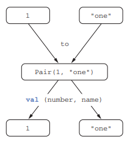

# 3.4 컬렉션 처리 : 가변 길이 인자, 중위 함수 호출, 라이브러리 지원

> 배울 내용
- vararg 키워드를 사용하면 호출 시 인자 개수가 달라질 수 있는 함수를 정의할 수 있다.

- 중위(infix) 함수 호출 구문을 사용하면 인자가 하나뿐인 메소드를 간편하게 호출할 수 있다

- 구조 분해 선언을 사용하면 복합적인 값을 분해해서 여러 변수에 나눠 담을 수 있다.


## 자바 컬렉션 API 확장

> 1. 리스트의 마지막 원소를 가져오는 예제
> 2. 숫자로 이뤄진 컬렉션의 최대값을 찾는 예제

```kotlin
val strings : List<String> = listOf("first","second","fourteenth")
strings.last() //fourteenth

val numbers : Collection<Int> = setOf(1,14,2)
numbers.max() //14
```

Qusetion) 어떻게 자바 라이브러리 클래스의 인스턴스인 컬렉션에 대해 코틀린이 새로운 기능을 추가할 수 있을까??<br>
Answer) last 와 max는 모두 **확장 함수**였던 것이다!! 
- last 함수는 List 클래스의 확장 함수이다.
- 실제 코틀린 라이브러리의 max는 Int를 포함하는 다양한 타입의 컬렉션에 대해 작동한다.

```kotlin
fun <T> List<T>.last():T // 마지막 원소를 반환
fun Collection<Int>.max():Int // 컬렉션의 최대값을 찾음
```

- 코틀린 표준 라이브러리는 수많은 **확장 함수**를 포함한다.
- 컬렉션이나 다른 객체에 대해 사용할 수 있는 메소드나 함수가 무엇인지 궁금할 때
	- IDE 코드 완성 기능을 통해 그런 메소드나 함수를 살펴볼 수 있다.
	- IDE가 표시해주는 목록에서 원하는 함수를 선택하기만 하라
	- 표준 라이브러리 참조 매뉴얼을 살펴보면 각 라이브러리 클래스가 제공하는 모든 메소드(멤버 메소드와 확장 함수)를 볼 수 있다.

## 가변 인자 함수 : 인자의 개수가 달라질 수 있는 함수 정의

### vararg (가변 인자)

이건 함수를 정의할 때, 그 함수가 인자를 몇 개 받을지 미리 정해두지 않아도 되는 기능이다. 예를 들어 `listOf` 함수는 원하는 만큼의 값을 받을 수 있다.

```kotlin
val list = listOf(2,3,5,7,11)

// 라이브러리에서 이 함수의 정의를 보면 다음과 같다.
fun listOf<T>(vararg values: T) : List<T> {...}
// `vararg values: T`는 "인자의 개수가 달라질 수 있다"는 의미
```

가변 길이 인자(varargs)는 메소드를 호출할 때 원하는 개수만큼 값을 인자로 넘기면 자바 컴파일러가 배열에 그 값들을 넣어주는 기능이다.

이미 배열에 들어있는 원소를 가변 길이 인자로 넘길 때도 코틀린과 자바 구문이 다르다.

자바에서는 배열을 그냥 함수에 넘기면 되지만, 코틀린에서는 배열을 **각 원소로 풀어서 전달**해야 한다. **스프레드 연산자**가 그런 작업을 해 줄 수 있다. 실제로는 전달하려는 **배열 앞에 \*를 붙이기만 하면 된다**.

```java
// 자바코드
public static void main(String[] args) {
    List<String> list = Arrays.asList(args);
    System.out.println(list);
}
```

```kotlin
// 코틀린 코드
fun main(args:Array<String>){
	val list = listOf("args: ", *args) // 스프레드 연산자가 배열의 내용을 펼쳐준다.
	println(list)
}
```

스프레드 연산자를 통하면 배열에 들어있는 값과 다른 여러 값을 함께 써서 함수를 호출할 수 있음을 보여준다. 이런 기능은 자바에서는 사용할 수 없다.

## 값의 쌍 다루기 : 중위 호출과 구조 분해 선언

### 맵을 만들 때 사용하는 `to`

```kotlin
val map = mapOf(1 to "one", 7 to "seven", 53 to "fifty-three")
```

- `to` 라는 단어는 코틀린 키워드가 아니다.
	- 이 코드는 `중위 호출(infix call)` 이라는 특별한 방식으로 `to` 라는 **일반 메소드를 호출**한 것

### 중위 호출(infix call) 설명

- 중위 호출 시 수신 객체와 유일한 메소드 인자 사이에 메소드 이름을 넣는다. 다음 두 호출은 동일하다.
	- 일반적인 함수 호출 : `to("one")` 
	- 중위 호출을 사용하여 자연스럽게 표현 : `to "one"`

- 이때 객체, 메소드 이름, 유일한 **인자 사이에는 공백**이 들어가야 한다.
- **인자가 하나만** 있을 때 사용 가능하다.

### `to` 함수의 정의
- 함수(메소드)를 중위 호출에 사용하게 허용하고 싶으면 **infix 변경자를 함수(메소드) 선언 앞에 추가**해야 한다. 다음은 to 함수의 정의를 간략하게 줄인 코드다.
```kotlin
infix fun Any.to(other:Any) = Pair(this, other)
```

- 이 to 함수는 Pair의 인스턴스를 반환한다. 
- Pair는 코틀린 표준 라이브러리 클래스로 그 이름대로 두 원소로 이뤄진 순서쌍을 표현한다. 
	- 실제로 to는 제네릭 함수
```kotlin
val pair = 1 to "one"
// 1과 'one'을 쌍으로 묶어서 Pair(1,"one")을 반환
```

### 구조 분해 선언(destructuring declaration)


#### 구조 분해 선언 예시
```kotlin
// Pair의 내용으로 두 변수를 즉시 초기화할 수 있다.
val (number,name) = 1 to "one"
```


- Pair 인스턴스 외 다른 객체에도 구조 분해를 적용 할 수 있다. 예를 들어 key와 value라는 두 변수를 맵의 원소를 사용해 초기화할 수 있다. 

#### 루프 구조 분해 
```kotlin
for ((index,element)) in collection.withIndex()){ println("$index:$element")}
```
-  joinToString에서 본 withIndex를 구조 분해 선언과 조합하면 컬렉션 원소의 인덱스와 값을 따로 변수에 담을 수 있다. 

- to 함수는 확장 함수다. to를 사용하면 타입과 관계없이 임의의 순서쌍을 만들 수 있다. 이는 to의  수신 객체가 제네릭하다는 뜻이다. 1 to "one" , "one" to , list to list.size() 등의 호출이 모두 잘 작동된다.

#### mapOf 함수의 선언
```kotlin
fun <K, V>mapOf(vararg values: Pair<K,V>): Map<K,V>
```
- listOf와 마찬가지로 mapOf에도 원하는 개수만큼 인자를 전달할 수 있다. 하지만 mapOf의 경우에는 각 인자가 키와 값으로 이뤄진 순서쌍이어야 한다.
- 코틀린을 잘 모르는 사람이 보면 새로운 맵을 만드는 구문은 코틀린이 맵에 대해 제공하는 특별한 문법인 것처럼 느껴진다. 하지만 실제로는 일반적인 함수를 더 간결한 구문으로 호출하는 것뿐이다.