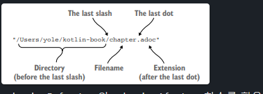

# 3.5 문자열과 정규식 다루기
### 코틀린 문자열은 자바 문자열과 같다. 

> 코틀린 코드가 만들어낸 문자열을 아무 자바 메소드에 넘겨도 된다.
> 자바 코드에서 받은 문자열을 아무 코틀린 표준 라이브러리 함수에 전달해도 전혀 문제 없음
> 특별한 변환도, 별도의 래퍼도 생기지 않는다.

## 문자열 나누기

```java
"12.345-6.A".split(".")
```

Question) 자바에서 String의 split 메소드에서 위에 코드의 호출 결과가 무엇일까?<br>
오해 답안) `[12, 345-6, A]` 배열이라고 생각하는 실수를 저지르는 개발자가 많다.<br>
정답) 자바의 split 메소드는 빈 배열을 반환한다.
- split의 구분 문자열은 실제로는 정규식이다.
- (.)마침표는 모든 문자를 나타내는 정규식으로 해석하기 때문

### 코틀린에서의 split

- 정규식을 파라미터로 받는 함수를 String이 아닌 Regex 타입의 값을 따로 받는다. 
	- 따라서 split 함수에 전달하는 값의 타입에 따라 정규식이나 일반 텍스트 중 어느 것으로 문자열을 분리하는지 쉽게 알 수 있다 !
- 코틀린 정규식 문법은 자바와 똑같다. 

```kotlin
//정규식 명시적으로 만들기
println("12.345-6.A".split("\\.|-".toRegex())) // [12, 345, 6, A] 

// split 확장 함수를 오버로딩한 버전(구분 문자열을 하나 이상 인자로 받음)
println("12.345-6.A".split(".","-")) // [12, 345, 6, A] 

```

## 정규식과 3중 따옴표로 묶은 문자열


substringBeforeLast와 substringAfterLast 함수를 활용해 경로를 나누어 본다. 

###  파일의 전체 경로명을 디렉터리, 파일 이름, 확장자로 구분해보자!

`"/Users/yole/kotlin-book/chapter.adoc"`

>String 확장 함수를 사용해 경로 파싱하기

```kotlin
fun parsePath(path:String){
	val directory = path.substringBeforeLast("/")
	val fullName = path.substringAfterLast("/")
	val fileName = fullName.substringBeforeLast(".")
	val extension = fullName.substringAfterLast(".")
	println("Dir : $directory, name: $fileName, ext: $extension")
}
parsePath("/Users/yole/kotlin-book/chapter.adoc")
// Dir : /Users/yole/kotlin-book, name: /Users/yole/kotlin-book/chapter, ext: adoc
```

> 경로 파싱에 정규식 사용하기

```kotlin
fun parsePath(path:String){
	val regex = """(.+)/(.+)\.(.+)""".toRegex()
	val matchResult = regex.matchEntire(path)
	if (matchResult != null){
		val (directory,fileName,extension) = matchResult.destructured
		println("Dir : $directory, name: $fileName, ext: $extension")
	}
}
parsePath("/Users/yole/kotlin-book/chapter.adoc")
// Dir : /Users/yole/kotlin-book, name: /Users/yole/kotlin-book/chapter, ext: adoc
```

- `3중 따옴표 문자열`을 사용해 정규식을 사용
	- 역슬래시(\\)를 포함한 어떤 문자도 이스케이프할 필요가 없다
	- ex) 원래 마침표 기호를 이스케이프 하려면 `\\.`라고 써야 하지만 3중 따옴표 문자열에서는 `\.`만 쓰면 된다.

- 위에 예제에서는 슬래시와 마침표를 기준으로 경로를 세 그룹으로 분리한다.
	- **(.+)/**: 디렉토리 부분. `( .+ )`는 **임의의 문자**가 **한 글자 이상** 오는 부분을 의미하고, `/`는 디렉토리 구분자이다.
	- **(.+).**: 파일 이름 부분. `( .+ )`는 역시 임의의 문자들이 오는 부분이고, `\\.`는 **점(`.`)**을 의미해. 점은 특수문자라서 **백슬래시**로 이스케이프 해줘야 한다.
	- **(.+)**: 확장자 부분. `( .+ )`는 확장자 부분의 문자를 찾음

- `matchEntire`는 **파일 경로가 이 정규식 패턴에 맞는지** 확인하고, 맞으면 결과를 반환

## 여러 줄 3중 따옴표 문자열

```kotlin
val kotlinLogo = """ | //
					.| //
					.|/ \"""
println(kotlinLogo.trimMargin("."))
/*
| // 
| // 
|/ \
*/
```

- trimMargin을 사용해 그 문자열과 그 직전의 공백을 제거한다. 
	- 위에서는 마침표를 들여쓰기 구분 문자열로 사용

> 문자열 템플릿$ 를 3중 따옴표 문자열 안에 넣을 때

```kotlin
val price = """${'$'}99.9"""
```
- 위에처럼 어쩔 수 없이 문자열 템플릿 안에 `'$'` 문자를 넣어야 한다.

