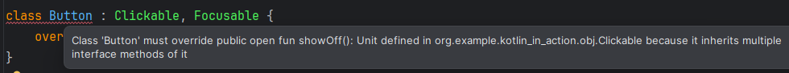
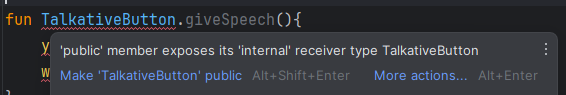
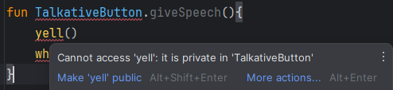
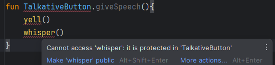

코틀린의 클래스를 다루는 방법을 이해하기위한 장

#### 자바의 클래스, 인터페이스와 다른점
- 인터페이스에 프로퍼티 선언이 들어갈 수 있음
- 코틀린 선언은 기본적으로 final, public 임
- 중첩클래스는 기본적으로 내부 클래스가 아님(외부 클래스에 대한 참조가 없음)
- 짧은 생성자 구문. 복잡한 경우를 대비한 문법도 있음(프로퍼티도 해당)

번잡스러움을 피하기 위해 유용한 메서드를 자동으로 만들어줌<br>
(클래스를 data로 선언하면 일부 표준 메서드를 만들어줌)<br>
코틀린이 제공하는 위임(delegation)을 사용하면 위임을 처리하기 위한 준비 메서드를 직접 작성할 필요가 없음

# 4.1 클래스 계층 정의

``sealed`` : 클래스 상속을 제한

## 4.1.1 코틀린 인터페이스
자바 8의 인터페이스와 비슷<br>
인터페이스 안에 추상 메서드와 구현이 있는 메서드 모두 정의 가능<br>
대신 필드는 들어갈 수 없음

```kt
// 인터페이스 선언
interface Clickable {
    fun click() // click 이라는 추상 메서드 정의
}
```

```kt
// 상속 및 추상메서드 구현
class Button : Clickable {
    override fun click() = println("I was cliked")
}

fun main() {
    Button().click()
}
```
```
I was cliked
```

자바에서는 extends와 implements 키워드를 사용하지만<br>
코틀린에서는 클래스 이름 뒤에 콜론(:)을 붙이고 인터페이스나 클래스를 적으면 <br>
클래스 확장(상속)이나 인터페이스 구현(지정)을 모두 처리 가능
> 인터페이스는 여러개 구현할 수 있지만 클래스는 하나만 확장가능

<br>

``override`` 변경자는 자바의 @Override 와 비슷함<br>
상위 클래스나 상위 인터페이스에 있는 프로퍼티나 메서드를 오버라이드(덮어쓰기)한다는 표시<br>

코틀린에서는 이 키워드를 꼭 사용해야함<br>
=> 실수로 상위 클래스의 메서드를 오버라이드 하는 경우를 방지하기 위함<br>
컴파일 시점에 확인하기 때문에 메서드명과 시그니처가 같으면 ``override``를 사용하거나 메서드명을 바꿔야함

<br>

인터페이스에 구현이 있는 메서드(자바의 default 메서드)도 작성가능<br>
코틀린에서는 default 키워드가 필요없음. 걍 구현 바로 가능
```kt
interface Clickable {
    fun click()
    fun showOff() = println("I`m clickable!")
}
```

만약 우연히 같은 메서드명과 시그니처를 같은 메서드를 갖고 있는 인터페이스들을<br>
하나의 클래스가 지정받으면 그 메서드는 어떻게 될까?
```kt
interface Focusable {
    fun setFocus(b:Boolean) = println("I ${if (b) "got" else "lost"} focus.")
    fun showOff() = println("I`m focusable!")
}
```
어느 쪽도 선택되지 않고 오버라이딩 메서드를 제공하지 않으면 컴파일 오류가 뜨면서 구현을 강제함


```kt
class Button : Clickable, Focusable {
    override fun click() = println("I was cliked")
    override fun showOff() {
        super<Clickable>.showOff()
        super<Focusable>.showOff()
    }
}
```
자바처럼 부모를 ``super``로 표현함<br>
자바에서는 ``Clickable.super.showOff()``로 기반타입을 표현해야 하지만<br>
코틀린에서는 ``super<Clickable>.showOff()``처럼 기반타입을 표현함

<br>

## 4.1.2 open, final ,abstract 변경자: 기본적으로 final

> 자바에서는 ``final`` 로 명시하지 않는 이상 모든 클래스는 다른 클래스가 상속 가능<br>
> => 취약한 기반 클래스(fragile base class) 문제 유발<br>
> 하위 클래스가 기반 클래스에 대해 가졌던 가정이 기반클래스가 변경되면서 깨져버리는 경우임<br>
> <br>
> 어떤 클래스가 자신을 상속하는 방법을 정확히 제공하지 않으면<br>
> 기반클래스를 작성한 사람의 의도와 다르게 오버라이드할 위험이 있고<br>
> 모든 하위 클래스를 분석하는 건 어렵기 때문에 <br>
> 기반클래스를 변경하는 경우 하위 클래스의 동작이 바뀔 수 있음 => 기반 클래스 취약<br>
> <br>
> Effectiv Java 에서는 ``상속을 위한 설계와 문서를 갖추거나, 그럴 수 없으면 상속을 금지하라`` 라고 함<br>
> 오버라이드하게 의도된 클래스가 아니면 (상속을 못하게)final로 만들라는 뜻

코틀린은 위의 철학을 따름, 기본적으로 클래스가 ``final``임<br>
상속을 허용하려면 ``open`` 키워드를 붙여야함
```kt
// 상속 가능하게 열려있는 클래스
open class RichButton:Clickable {
    fun disable() {} // final 이어서 하위 클래스가 오버라이드 못함
    open fun animate() {} // 하위 클래스가 오버라이드 가능
    override fun click() {} // 상위 클래스의 메서드를 오버라이드 함.
    // 오버라이드한 메서드는 기본적으로 open 임
}
```
만약 오버라이드한 메서드의 구현을 하위 클래스에서 오버라이드하지 못하게 하려면 <br>
오버라이드 하는 메서드 앞에 ``final``을 붙여야함
```kt
final override fun click() {}
```
> **열린 클래스와 스마트 캐스트**<br>
> 클래스의 기본 상속 가능 상태를 ``final``로 함으로써 얻을 수 있는 이익.<br>
> + 다양한 경우에 스마트 캐스트가 가능함<br>
> => 스마트 캐스트로 문법이 더 간결해짐
>
> 스마트 캐스트는 타입 검사 후 변경될 수 없는 경우에만 가능하기 때문임

<br>

코틀린도 클래스를 ``abstract``로 선언 가능함<br>
추상 클래스는 인스턴스화 할 수 없음<br>
구현이 없는 추상 멤버가 있기 때문<br>
그래서 하위클래스에서 추상 멤버를 오버라이드 하는것이 보통이고<br>
추상 멤버는 항상 ``open``임

```kt
// 추상 클래스 선언, 인스턴스화 할 수 없음
abstract class Animated {
    abstract fun animate() // 구현이 없기 때문에 하위 클래스에서 오버라이드 해야함
    fun animateTwice(){} // 구현된 함수는 기본적으로 final
    open fun stopAnimatin(){} // 원한다면 open 할 수 있음
}
```

<br>

#### 클래스 내의 상속 제어 변경자 의미
| 변경자 | 의미 | 설명 |
| :--- | :--- | :--- |
| ``final`` | 오버라이드 불가 | 클래스 멤버의 기본 변경자 |
| ``open`` | 오버라이드 가능 | 이걸 명시해야 오버라이드 가능 |
| ``abstract`` | 반드시 오버라이드 해야함 | 추상 클래스의 멤버에만 붙일 수 있음<br>이게 붙으면 구현이 있으면 안됨 |
| ``override`` | 상위 클래스의 멤버를 오버라이드 | 오버라이드 하는 멤버는 기본적으로 열려있음<br>하위 클래스의 오버라이드를 금지하려면 ``final``을 붙이면 됨 |

<br>

## 4.1.3 가시성 변경자: 기본적으로 공개

가시성 변경자(visibility modifier) : 클래스 외부의 접근을 제어함

자바와 같이 ``public``, ``protected``, ``private`` 이 있는데<br>
(1)자바와 달리 기본적으로 ``public`` 임
> 자바의 기본 가시성은 ``package-private``인데 코틀린에는 아예 없음<br>
> 코틀린은 패키지를 네임스페이스를 관리하기 위한 용도로만 사용해서 패키지를 가시성 제어에 사용하지 않음<br>
> 네임스페이스 : 식별자(변수, 함수 등)가 유효한 범위 혹은 영역

(2)패키지 전용 가시성 대신 ``internal``이라는 변경자를 도입함<br>
"모듈 내부에서만 볼 수 있음" 이라는 뜻<br>
**모듈** : 한꺼번에 컴파일되는 코틀린 파일들
> #### 모듈 내부 가시성의 장점
> - 진정한 캡슐화를 제공<br>
> 자바에서는 패키지가 같은 클래스를 선언만 하면 <br>
> 프로젝트 외부의 코드가 패키지 내부에 있는 패키지 전용 선언에 접근 할 수 있음

(3)자바와의 또 다른 점은 코틀린은 최상위 선언에 대해 ``private`` 가시성을 허용함<br>
이렇게 하면 해당 파일 내에서만 사용이 가능할 수 있게 되고<br>
구현을 외부에 감추기 좋음

| 변경자 | 클래스 멤버 | 최상위 선언 |
| :--- | :--- | :--- |
| ``public``(기본) | 모든 곳에서 볼 수 있음 | 모든 곳에서 볼 수 있음 |
| ``internal`` | 같은 모듈 안에서만 볼 수 있음 | 같은 모듈 안에서만 볼 수 있음 |
| ``protected`` | 하위 클래스 안에서만 볼 수 있음 | (최상위 선언에 적용 불가) |
| ``private`` | 같은 클래스 안에서만 볼 수 있음 | 같은 파일 안에서만 볼 수 있음 |

```kt
// 예제 코드
internal open class TalkativeButton:Focusable {
    private fun yell() = println("Hey!")
    protected fun whisper() = println("Let`s talk!")
}
fun TalkativeButton.giveSpeech(){
    yell()
    whisper()
}
```
<br>
``public`` 함수인 ``giveSpeech``가 가시성이 낮은 타입을 참조하지 못해서 오류

<br>
``private``에는 접근할 수 없어서 오류

<br>
``protected``에 접근할 수 없어서 오류

> ``giveSpeech``의 컴파일 오류를 없애려면 ``giveSpeech``의 가시성을 ``internal`` 로 바꾸던가<br>
> TalkaticeButton 클래스의 가시성을 ``public``으로 바꾸면 됨

(4)자바에서는 같은 패키지 안에서 ``pretected`` 멤버에 접근할 수 있지만<br>
코틀린은 안됨.<br>
코틀린에서의 ``protected``는 자신이나 하위 클래스에서만 볼 수 있음
> 코틀린의 ``private`` 클래스는 컴파일 시 자바의 패키지 전용 클래스로 컴파일 됨<br>
> ``internal``은 ``public``이 됨<br>
> 이런 차이 때문에 코틀린에서는 접근하지 못하는 것들이 자바에서는 접근이 가능한 경우가 생김<br>
>
> 이번 문제를 해결하고자 mangling을 사용하는데 이름일 이상하게 바꾼다는 거임<br>
> 이렇게 바꾸면 시그니처가 우연히 같아서 오버라이드 되는 경우를 경우를 방지할 수 있고<br>
> ``internal``에 접근하는 것을 힘들게 만듦

(5)코틀린에서는 외부 클래스가 내부 클래스나 중첩된 클래스의 ``private``멤버에 접근 불가

<br>

## 4.1.4 내부 클래스와 중첩된 클래스: 기본적으로 중첩 클래스
클래스 안에 클래스 선언 가능<br>
도우미 클래스를 캡슐화하거나 코드 정의를 사용하는 곳 가까이에 두고싶을 때 유용

코틀린에서 중첩 클래스(nested class)는 요청하지 않는 한 바깥쪽 클래스 인스턴스에 대한 접근 권한이 없음
```kt
interface State:Serializable {
}

interface View{
    fun getCurrentState():State
    fun restoreState(state: State){}
}
```
```java
import org.example.kotlin_in_action.obj.nestTest.State;
import org.example.kotlin_in_action.obj.nestTest.View;
import org.jetbrains.annotations.NotNull;

import java.io.*;

public class ViewButton implements View {
    private String name;

    public ViewButton(String name) {
        this.name = name;
    }

    @NotNull
    @Override
    public State getCurrentState() {
        ButtonState state = new ButtonState();
        state.name = this.name;
        return state;
    }

    @Override
    public void restoreState(@NotNull State state) {
        System.out.println("restore");
    }
    public class ButtonState implements State{
        private String name;

        @Override
        public String toString() {
            return "ButtonState{" +
                    "name='" + name + '\'' +
                    '}';
        }
    }

    public static void main(String[] args) throws IOException, ClassNotFoundException {
        ViewButton viewButton = new ViewButton("test");
        State state = viewButton.getCurrentState();

        // 직렬화
        ByteArrayOutputStream baos = new ByteArrayOutputStream();
        ObjectOutputStream oos = new ObjectOutputStream(baos);
        oos.writeObject(state);

        // 역직렬화
        ByteArrayInputStream bais = new ByteArrayInputStream(baos.toByteArray());
        ObjectInputStream ois = new ObjectInputStream(bais);
        State readObject = (State) ois.readObject();

        // 원래 객체와 역직렬화된 객체 비교
        System.out.println("origin state is " + state.toString());
        System.out.println("serialize test state is " + readObject.toString());
    }
}
```
```
Exception in thread "main" java.io.NotSerializableException: kotlin_in_action.obj.nestTest.ViewButton
```
자바는 클래스 안에 다른 클래스를 정의하면 기본적으로 내부(inner)클래스가 됨<br>
내부 클래스는 외부 클래스에 대한 참조를 묵시적으로 포함하고 있음(ViewButton.ButtonState)<br>
이 참조때문에 ViewButton이 직렬화 가능하지 않기 때문에 내부에 있는 ButtonState 이 직렬화 불가능해짐

ButtonState를 static으로(중첩클래스로) 선언하면 바깥쪽 클래스에 대한 묵시적인 참조가 사라져서 오류 안남
```kt
class Button(val name:String):View {
    override fun getCurrentState(): State = ButtonState(name)
    override fun restoreState(state: State) {}
    class ButtonState(val name: String) : State{} // 자바의 중첩 클래스와 같음
}
```

코틀린에서는 클래스 내부에 클래스를 작성하면 기본적으로 중첩 클래스이고<br>
내부 클래스로 만들고 싶으면 ``inner``를 붙여야함
| 클래스 B 안에 정의된 클래스 A | 자바 | 코틀린 |
| :--- | :--- | :--- |
| 중첩 클래스 | ``static class A`` | ``class A`` |
| 내부 클래스 | ``class A`` | ``inner class A`` |

<br>

바깥쪽 클래스의 인스턴스를 가리키는 참조 표기법도 다름
```kt
// 코틀린
class Outer {
    inner class Inner{
        fun getOuterReference():Outer=this@Outer
    }
}
```
```java
// 자바
public class Outer {
    class Inner{
        public Outer getOuter(){return Outer.this;}
    }
}
```

<br>

## 4.1.5 봉인된 클래스: 클래스 계층 정의 시 계층 확장 제한

2.3.5 절에서 본 클래스 계층을 다시 생각해보자
```kt
interface Expr {}

class Num(val value: Int) : Expr
class Sum(val left:Expr, val right:Expr): Expr

fun eval(e:Expr):Int = when(e){
    is Num -> e.value
    is Sum -> eval(e.left) + eval(e.right)
    else -> throw IllegalArgumentException("Unknown expression")
}
```
이렇게 하위 클래스에 대한 처리를 when 으로 할 때 반드시 else 분기를 추가해야 하고(when 문법 때문)<br>
새로운 하위 클래스를 추가했을때 분기처리를 잊으면 디폴트 분기 때문에 버그가 발생할 수도 있음<br>
이때 ``sealed``클래스 사용
> ``sealed`` : 상위 클래스를 상속한 하위 클래스 정의를 제한 가능
```kt
sealed class SealedExpr {
    class SealedNum(val value:Int):SealedExpr()
    class SealedSum(val left:SealedExpr, val right:SealedExpr):SealedExpr()
}

fun eval(e:SealedExpr):Int = when(e){
    is SealedExpr.SealedNum -> e.value
    is SealedExpr.SealedSum -> eval(e.left) + eval(e.right)
}
```
``sealed``클래스는 자신의 하위 클래스를 중첩 클래스 형태로 두게 되고<br>
중첩 클래스 이외에 상속 받는 것을 막음<br>
when 식도 클래스의 상속이 제한되어 있으므로 else 문이 필수가 아님<br>
나중에 하위 클래스를 추가하면 when 식이 컴파일이 되지 않기 때문에 수정해야한다는 것을 알 수 있음

[sealed 동작 참고](https://medium.com/hongbeomi-dev/sealed-class%EC%99%80-sealed-interface-db1fff634860)