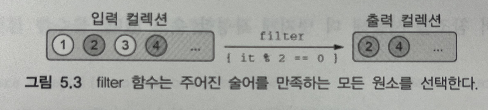
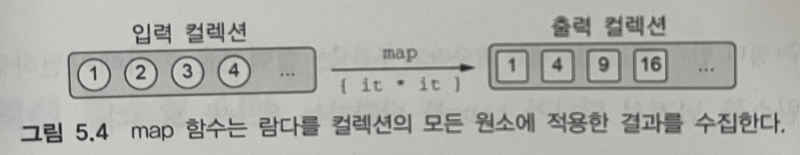

# 5.2 컬렉션 함수 API

함수형 프로그래밍 스타일은 컬렉션을 다룰 때 많이 사용하게 된다. 코틀린에서 컬렉션을 다루는 코틀린 표준 라이브러리를 몇 가지 살펴보자.

## 5.2.1 필수적인 함수 : filter 와 map

대부분의 컬렉션은 filter와 map을 통해 처리가 가능하다. filter는 컬렉션에서 원하는 요소를 제거하는 기능, map은 원소를 변환하는 기능을 제공한다.

### filter

```java
fun main(args: Array<String>) {  
    val list = listOf(1, 2, 3, 4)  
    println(list.filter { it % 2 == 0 })  
}

>>> [2, 4]
```

filter는 컬렉션을 이터레이션(반복)하면서 주어진 람다에 각 원소를 넘겨서 람다가 true를 반환하는 원소만 모은다.



- 나이가 30 초과하는 원소만을 새로운 컬렉션으로 만드는 방법

```java
data class Person(val name: String, val age: Int)  
  
fun main(args: Array<String>) {  
    val people = listOf(Person("진성", 32), 
    Person("효범", 31), Person("민재", 33), 
    Person("선미", 26), Person("지언", 28), Person("인우", 27))  
    println(people.filter { it.age > 30 })  
}

>>> [Person(name=진성, age=32),Person(name=효범, age=31),Person(name=민재, age=33)]
```

### map

```java
val list = listOf(1, 2, 3, 4)
println(list.map { it * it })

>>> [1, 4, 9, 16]
```

만약 컬렉션의 원소를 변환하고 싶으면 map 함수를 사용해야한다.

map함수는 주어진 람다를 컬렉션의 각 원소에 적용한 결과를 모아서 새 컬렉션을 만든다.



사람의 리스트가 아니라 이름의 리스트를 출력하고 싶으면 map으로 사람의 리스트를 이름의 리스트로 변환하면 된다.

```java
fun main(args: Array<String>) {  
    val people = listOf(Person("진성", 32), 
    Person("효범", 31), Person("민재", 33), 
    Person("선미", 26), Person("지언", 28), Person("인우", 27)) 
    println(people.map { it.name })  
    // 리팩토링 : 멤버 참조 사용
    println(people.map(Person::name))
}

>>> [진성, 효범, 민재, 선미, 지언, 인우]
```

### filter와 map 연계

- 나이가 30을 초과하는 사람의 이름을 출력

```java
people.filter{ it.age>30 }.map(Person::name)
>>> [진성, 효범, 민재]
```

**가장 나이가 많은 사람의 이름을 구하는 방법**

- **방법 1:** 나이 최댓값을 여러 번 계산하는 비효율적인 방법

```java
people.filter { it.age == people.maxBy(Person::age)!!.age }
```

- `people.maxBy(Person::age)`를 통해 목록에서 나이가 가장 많은 사람을 찾음
- `people.filter`는 해당 최댓값과 나이가 같은 사람을 모두 필터링
- **문제**: `people.maxBy`가 `filter` 안에서 매번 호출되기 때문에, **비효율적**(시간 복잡도 O(n²)

- **방법 2**: 나이 최댓값을 한 번만 계산하여 성능 향상

```java
val maxAge = people.maxBy(Person::age)!!.age
people.filter { it.age == maxAge }
```

- 먼저 **최댓값을 한 번만 계산**해 `maxAge` 변수에 저장
- 그 후, `filter`를 사용해 나이가 `maxAge`와 같은 사람을 필터링
- **장점**: 최댓값을 한 번만 계산하므로, 시간 복잡도는 O(n)

### Map에서 값을 변환하는 방법

맵에서 키와 값을 변환하는 함수인 `mapKeys`, `mapValues`를 사용해 값을 변환

```java
val numbers = mapOf(0 to "zero", 1 to "one")
println(numbers.mapValues { it.value.toUpperCase() })

>> {0=ZERO, 1=ONE}
```

## 5.2.2 all, any, count, find : 컬렉션에 술어(긍정부정) 적용

컬렉션의 모든 원소가 어떤 조건을 만족하는지 판단하는 연산

- all : 특정 조건에 원소가 모두 만족하였는지 판단
- any : 특정 조건에 원소가 일부 만족하였는지 판단

```java
data class Person(val name: String, val age: Int)  
  
val canBeInClub27 = { p: Person -> p.age <= 27 }   // 27세 이하를 판단하는 술어 선언
  
fun main(args: Array<String>) {  
    val people = listOf(Person("진성", 32), 
    Person("효범", 31), Person("민재", 33), 
    Person("선미", 26), Person("지언", 28), Person("인우", 27)) 
     
    println(people.all(canBeInClub27))  // 컬렉션의 원소가 모두 만족하는지 확인
    >>> false
		println(people.any(canBeInClub27))  // 컬렉션의 원소가 일부 만족하는지 확인
		>>> true
}
```

조건에 대한 코딩 가독성을 높이기 위해 any와 all앞에 !를 붙이지 않는 편이 좋다.

!all은 any(조건부정)과 치환 가능

!any은 all(조건부정)과 치환 가능

```java
fun main(args: Array<String>) {  
    val list = listOf(1, 2, 3)  
    // 가독성 구림
    println(!list.all { it == 3 }) // 모든 원소가 3이 아님
    // 가독성 괜찮
    println(list.any { it != 3 })  // 적어도 하나는 3이 아님
}
```

- count : 조건을 만족하는 원소의 개수 반환

count - 조건을 만족하는 원소의 개수만을 추적, 원소를 따로 저장하지 않음

```java
people.filter(canBeInClub27).size // 내부적으로 중간 컬렉션이 생김
people.count(canBeInClub27) 
```

- find : 조건을 만족하는 첫 번째 원소를 반환 == firstOrNull

```java
val canBeInClub27 = { p: Person -> p.age <= 27 }  
  
fun main(args: Array<String>) {  
    val people = listOf(Person("Alice", 27), Person("Bob", 31))  
    println(people.find(canBeInClub27))  // 만족하는 원소가 없는 경우 null을 반환
    println(people.firstOfNull(canBeInClub27))  // null 반환을 명시적으로 표현하려는 경우
}
```

## 5.2.3 groupBy : 리스트를 여러 그룹으로 이뤄진 맵으로 변경

컬렉션의 모든 원소를 어떤 특성에 따라 여러 그룹으로 나누려는 경우 사용

- age를 기준으로 별도의 Person 컬렉션을 생성하는 사례
    - groupBy의 결과 타입은 Map<Int, List<Person>>
    - 필요한 경우 결과 Map을 mapKeys나 mapValues 등을 사용하여 변경 가능

```kotlin
data class Person(val name: String, val age: Int)

fun main(args: Array<String>) {
    val people = listOf(Person("진성", 32), 
    Person("효범", 32), Person("민재", 33), 
    Person("선미", 27), Person("지언", 27), Person("인우", 27)) 
    println(people.groupBy { it.age })
}

>>> 
{
    32=[
	    Person(name=진성, age=32), 
		   Person(name=효범, age=32)
		], 
    33=[
	    Person(name=민재, age=33)
    ], 
    27=[
	    Person(name=선미, age=27), 
	    Person(name=지언, age=27), 
	    Person(name=인우, age=27)
    ]
}
```

## 5.2.4 flatMap과 flatten : 중첩된 컬렉션 안의 원소 처리

flatMap 하수는 먼저 인자로 주어진 람다를 컬렉션의 모든 객체에 적용하고, 람다를 적용한 결과 얻어지는 여러 리스트를 한 리스트로 모은다.

- 두 개의 문자열 리스트를 단일 리스트로 변환하는 방법

```kotlin
fun main(args: Array<String>) {  
    val strings = listOf("abc", "def")  
    println(strings.flatMap { it.toList() })  
}

>>> [a,b,c,d,e,f]
```

- toSet을 통해 flatMap 결과 리스트에서 중복을 없앤 집합을 만드는 방법

```kotlin
fun main(args: Array<String>) {  
    val books = listOf(Book("Thursday Next", listOf("Jasper Fforde")),  
                       Book("Mort", listOf("Terry Pratchett")),  
                       Book("Good Omens", listOf("Terry Pratchett",  
                                                 "Neil Gaiman")))  
    println(books.flatMap { it.authors }.toSet())  
}`
```
