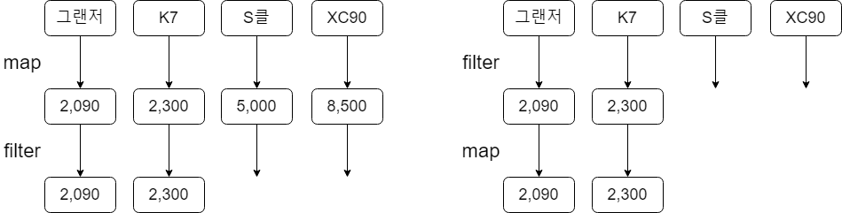

# 5.3 지연계산 (lazy) 컬렉션 연산

컬렉션을 사용할 때 map, filter의 결과를 즉시 새로운 리스트에 담는다. 결국 map, filter, map … 등의 연속된 작업이 많아지면 그때마다 새로운 List를 생성하고, 결괏값을 임시 저장한다.

이는 컬렉션의 원소가 수백만 개가 되면 훨씬 비효율적이다.

이를 더 효과적으로 만들기 위해 시퀀스를 사용해야한다.

**시퀀스(Sequence)**는 중간 임시 컬렉션을 사용하지 않고 컬렉션 연산을 연쇄할 수 있다.

정리하면, Sequence의 강점은 원소가 필요할 때 계산이 되기 때문에, 중간 처리 결과를 저장하지 않고도 연산을 연쇄적으로 적용해서 효율적으로 계산을 수행할 수 있다.

```kotlin
people.asSequence() //원본 컬렉션을 시퀀스로 변환
      .map(Person::name)
      .filter { it.startsWith("김") }
      .toList() //결과 시퀀스를 다시 리스트로 변환
```

asSequence 확장 함수를 호출하면 어떤 컬렉션이든 시퀀스로 바꿀 수 있고, 시퀀스를 리스트로 만들 때는 toList를 사용한다.

그런데 왜, 시퀀스를 다시 컬렉션으로 되돌려야 할까요? 컬렉션보다 시퀀스가 더 좋다면 그냥 시퀀스를 쓰는면 되는것이 아니냐라고 생각할 수 있다. → 경우에 따라 다르다.

시퀀스의 원소를 차례로 이터레이션(반복) 해야한다면 시퀀스를 직접 써도 되지만,

시퀀스 원소를 인덱스를 사용해 접근 하는 등의 다른 API 메서드가 필요하다면 시퀀스를 리스트로 변환해서 사용해야한다.

<aside>
💡

큰 컬렉션에 대해서 연산을 연쇄하려는 경우 시퀀스를 사용하는 것을 규칙으로 삼아라!

</aside>

## 5.3.1 시퀀스 연산 실행 : 중간 연산과 최종 연산

시퀀스에 대한 연산은 중간(intermediate) 연산과 최종(terminal) 연산으로 나뉜다.

**중간 연산은 다른 시퀀스를 반환하고, 최종 연산은 결과를 반환한다.**

**결과는** 최초 컬렉션에 대해 변환을 적용한 **시퀀스로부터 일련의 계산을 수행해 얻을 수 있는 컬렉션이나 원소, 숫자 또는 객체이다.**


중간 연산은 항상 지연 계산되고, 최종 연산을 호출하면 비로소 연기되었던 모든 계산이 수행된다.

```kotlin
/* 최종 연산이 없는 경우 */
val sequence = listOf(1, 2, 3, 4)
  .asSequence()
  .map {
    print("map : $it")
    it * it
  }
  .filter {
    print("filter : $it")
    it > 5
  }

  println(sequence)
  >>> kotlin.sequences.TransformingSequence@<some_hash_code>
```

위 코드를 실행하면 아무런 내용도 출력되지 않는다.

이유는, map과 filter 변환이 지연 계산되기 때문에 결과 얻을 필요가 있는 최종 계산이 호출 돼야 적용이 된다.

```kotlin
/* 최종 연산이 호출되는 경우 */
val list = listOf(1, 2, 3, 4)
  .asSequence()
  .map {
    print("map : $it")
    it * it
  }
  .filter {
    print("filter : $it")
    it > 5
  }
  .toList()

println("리스트 결과 : $list")

>>>
	map : 1
	filter : 1
	map : 2
	filter : 4
	map : 3
	filter : 9
	map : 4
	filter : 16
	리스트 결과 : [9, 16]
```

출력된 결과를 보면 시퀀스의 모든 연산은 각 원소에 대해서 순차적으로 적용되는걸 확인할 수 있다.

- 즉, 첫 번째 원소가 map -> filter 처리 후, 두 번째 원소가 map -> filter 처리되는 방식

이러한 연산 수행 순서는 프로그램 성능에도 영향을 끼칠 수 있다.

carList 라는 컬렉션이 있는데 가격이 4,000만원 이하인 매물만 얻고 싶다.

이를 처리하기 위해서는 각 매물(Car 객체)의 가격(price)으로 map 한 다음에 4,000만원 초과인 매물을 제외시켜야 한다.

이 경우 map 다음에 filter를 하는 경우와 filter 다음에 map을 하는 경우 결과는 같아도 수행해야 하는 변환의 횟수에서 크게 차이가 난다.

```kotlin
val carList = listOf(Car("현대", "그랜저", 2,090), Car("기아", "K7", 2,300),
			Car("벤츠", "S클래스", 5,000), Car("볼보", "XC90", 8,500))

// map 다음에 filter 수행
>>> println(carList.asSequence().map(Car::price).filter{it <= 4000}.toList())
[2090, 2300]

// filter 다음에 map 수행
>>>  println(carList.asSequence().filter{it.price <= 4000}.map(Car::price).toList())
[2090, 2300]
```



위의 그림과 같이, map을 먼저 하면 모든 원소를 이터레이션 하게 된다.

반면에 filter를 먼저 하게 되면 조건에 맞는 원소만 이터레이션 하기 때문에 성능상 더 효율적인 이점이 있다.

## 5.3.2 시퀀스 만들기 **-  asSequence(), generateSequence()**

지금까지 살펴본 시퀀스 예제는 모두 컬렉션에 대해 asSequence()를 호출해서 만들었다.

시퀀스를 만드는 다른 방법으로 generateSequence 함수도 사용할 수 있다.

generateSequence 함수를 사용해서 0부터 100까지 자연수의 합을 구하는 예제이다.

```kotlin
val numbers = generateSequence(0) { it + 1 }
val numbersTo100 = numbers.takeWhile { it <= 100 }
println(numbersTo100.sum()) //모든 연산은 "sum()"이 호출될 때 수행된다. (최종 연산)

>>> 5050
```