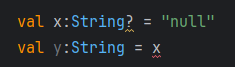
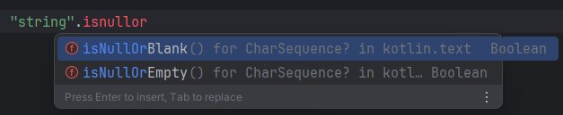
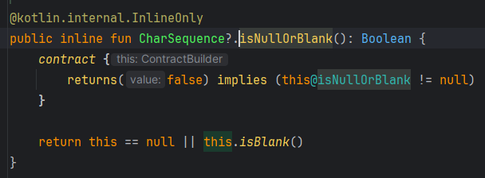
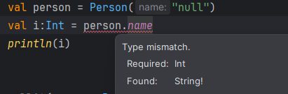

이전까지는 코틀린의 문법을 배웠다면 이제는 타입 시스템을 배울 시간임

코틀린의 타입 시스템은 가독성 향상을 위한 특성을 제공하고있고<br>
대표적으로 nullable type 과 읽기 전용 컬렉션이 있음

# 6.1 널 가능성

널 가능성(nullableity)는 NullPointerException 오류를 피할수 있게 돕기위한 코틀린 타입시스템 특성임

최신 언어에서 null에 대한 접근 방법은 가능한 이 문제를 컴파일 시점으로 옮기는 것임<br>
널 가능성 여부를 타입 시스템에 추가해 커파일러가 여러 오류를 컴파일 시점에 미리 감지하여 <br>
런타임 시 발생할 수 있는 예외를 줄여줌

<br>

## 6.1.1 널이 될 수 있는 타입
코틀린은 널이 될 수 있는 타입을 명시적으로 지원함<br>
변수가 널이 될 수 있으면 NPE가 발생할 수 있는 메서드 호출을 금지함으로써 오류를 방지함
```java
int strLen(String s){
    return s.length();
}
```
만약 s 에 null을 넘기면 NPE 터짐
```kt
// s:String 은 s가 항상 String 이어야 한다는 뜻
fun strLen(s:String) = s.length
```
코틀린은 ``strLen``에 null이나 null이 될 수 있는 인자를 넘기면 컴파일 시 오류남

```kt
// 만약 널도 인자로 받을 수 있게 하려면 아래처럼 해야됨
fun strLen(s:String?) = s.length
```

타입 뒤에 ?를 붙이면 null 참조를 저장할 수 있다는 뜻


널이 될 수 있는 타입 변수에 직접 메서드 호출을 하면 컴파일 시 막음

```kt
// 이렇게 검사해줘야함
fun strLen(s:String?) = if (s != null)s.length else 0
```

널이 될 수 있는 값을 널이 될 수 없는 변수에 대입할 수 없음<br>


<br>

## 6.1.2 타입의 의미

타입 : 분류. 어떤 값들이 가능한지, 그 타입이 수행할 수 있는 연산의 종류를 결정함

자바의 String 같은 객체는 String과 null을 담을 수 있음<br>
둘은 엄연히 다름. => 자바가 널을 제대로 다루지 못한다는 의미
> @Nullable, @NotNull 같은 어노테이션으로 검사할 수도 있지만 번거롭고 까먹을 수 있음<br>
> Optional 타입을 사용할 수도 있지만 코드가 지저분해지고 래퍼가 추가되어서 성능이 떨어짐

코들린은 널이 될 수 있는 타입과 널이 될 수 없는 타입을 구분해서 아예 컴파일 시 연산 자체를 막을 수 있음 <br>
=> 널에 대해 엄격하지만 편하게 쓰기 위해 연산자를 추가함

<br>

## 6.1.3 안전한 호출 연산자: ?.

?. 연산자는 null 검사와 참조를 한 번에 함<br>
``s?.toUpperCase()`` 는 ``if (s!=null) s.toUpperCase() else null`` 과 같음<br>

```kt
class Address(val streetAddress:String, val zipCode:Int,
                val city:String, val coutry:String)
class Company(val name:String, val address:Address?)
class Person(val name:String, val company:Company?)

fun Person.countryName():String{
    val coutry = this.company?.address?.coutry // 안전한 호출 연산자를 사용해서 담은 변수도 nullable 임
    return if (coutry != null) coutry else "Unknown"
}
```

<br>

## 6.1.4 엘비스 연산자: ?:
null 대신 사용할 디폴트 값을 지정할 때 사용
```kt
fun foo(s:String?){
    val t:String = s ?: ""
}
```
이항 연산자로 좌항이 널이 아니면 좌항으로 널이면 우항을 결과값으로 함
```kt
// 위에서 정의한 Person.countryName 확장 함수를 이렇게 바꿀 수 있음
fun Person.countryName():String = this.company?.address?.coutry ?: "Unknown"
```

코틀린에서는 return 이나 throw도 식이기 때문에 엘비스 연산자 우항에 return 과 throw를 넣을 수 있음
```kt
fun printShippingLabel(person:Person?){
    val address = person?.company?.address ?: throw IllegalArgumentException("No address")
    with(address){
        println(streetAddress)
        println("$zipCode $city, $coutry")
    }
}
```

<br>

## 6.1.5 안전한 캐스트: as?

as? 는 지정한 타입으로 캐스팅하고 캐스팅 할 수 없으면 null 을 반환
```kt
class Person(val name:String, val company:Company?){
    override fun equals(other: Any?):Boolean{
        val otherPerson = other as? Person ?: return false
        return otherPerson.name == name
    }
}
```

<br>

## 6.1.6 널 아님 단언: !!
변수 뒤에 사용할 수 있고 강제로 널이 될 수 없는 타입으로 바꿈
```kt
fun ignoreNulls(s:String?){
    val sNotNull = s!!
    println(sNotNull.length)
}

fun main() {
    ignoreNulls(null)
}
```
```
Exception in thread "main" java.lang.NullPointerException
	at org.example.kotlin_in_action.nullable.NonNullAssertionKt.ignoreNulls(NonNullAssertion.kt:6)
	at org.example.kotlin_in_action.nullable.NonNullAssertionKt.main(NonNullAssertion.kt:11)
	at org.example.kotlin_in_action.nullable.NonNullAssertionKt.main(NonNullAssertion.kt)
```
이 연산자를 사용하면 NPE가 발생할 수 있게 되고<br>
만약 발생하면 연산자를 사용한 부분을 알려줌

언제나 null이 아닌 값을 전달받는 다는 것을 알지만 Nullable 인 값을 받을 때 사용하면 좋음
```kt
class CopyRowAction(val list:JList<String>) : AbstractAction(){
    override fun isEnabled():Boolean = list.selectedValue != null
    // isEnabled 가 true 인 경우에만 호출되는 함수
    override fun actionPerformed(e: ActionEvent?) {
        val value = list.selectedValue!!
        /* ... 나머지 로직 */
    }
}
```

!!는 예외가 어느 줄에서 발생했는지 알려주긴 하지만 어느 식에서 발생했는지는 알려주지 않음
```kt
// 이런식으로 작성하는건 비추
person.company!!.address!!.country
```

<br>

## 6.1.7 let 함수

호출하는 객체를 인자로 같는 임의의 함수를 실행함

안전한 호출 연산자와 함께 사용하면 원하는 식을 null 검사와 그 결과를 변수에 넣은 작업을 한번에 처리 가능
```kt
fun sendEmailTo(email:String) = println("send email to $email")

fun main() {
    val email:String? = null
    email?.let { sendEmailTo(it) }
}
```

<br>

## 6.1.8 나중에 초기화할 프로퍼티

코틀린은 일반적으로 생성자에서 모든 프로퍼티를 초기화해야함<br>
만약 생성자 호출 시 초기화 값을 제공할 수 없으면 Nullable 타입을 사용할 수 밖에 없음<br>
Nullable 타입을 사용하면 null 검사를 하던가 !!을 사용해야함<br>
이러면 코드가 더러워지기 때문에 ``lateinit``이라는 변경자를 만듦
```kt
class MyService{
    fun performAction():String = "foo"
}
class MyTest{
    private lateinit var myService: MyService
    @BeforeEach fun setUp(){
        myService = MyService()
    }
    @Test
    fun testAction(){
        Assertions.assertEquals("foo", myService.performAction())
    }
}
```
> ``lateinit``을 사용하면 나중에 프로퍼티를 초기화 할 수 있음<br>
> ``val``은 ``final``로 컴파일 되기 때문에 ``lateinit``을 붙이는 프로퍼티는 ``var`` 여야함

만약 초기화 하지 않고 프로퍼티를 사용하면 아래처럼 오류가 뜸
```
kotlin.UninitializedPropertyAccessException: lateinit property myService has not been initialized
```

<br>

## 6.1.9 널이 될 수 있는 타입 확장
Nullable 타입에 확장 함수를 정의하면 null을 다루는 강력한 도구로 사용할 수 있음<br>

메서드를 호출하기 전에 수신 객체 역할을 하는 변수가 널이 될 수 없다고 보장하는 대신<br>
직접 변수에 대해 메서드를 호출해도 확장함수인 메서드가 알아서 널을 처리함



nullable 한 타입에 확장함수를 정의할 수 있기 때문에 <br>
함수 내부의 ``this``는 null이 될 수도 있음(자바는 절대 null이 아님)

<br>

## 6.1.10 타입 파라미터의 널 가능성
코틀린에서 함수나 클래스의 타입파라미터는 기본적으로 nullable 임
```kt
fun <T> printHashCode(t:T){
    println(t?.hashCode())
}
fun main() {
    printHashCode(null)
}
```
타입 파라미터 T에 대한 추론 타입은 Any? 임<br>
타입 파라미터에 널이 아님을 확실히 하려면 타입 상한을 지정해야함
```kt
fun <T:Any> printHashCode(t:T){
    println(t.hashCode())
}
fun main() {
    printHashCode(null) // 컴파일 오류
}
```
상한지정은 9장에서 제네릭을 다루면서 자세히 다룸

<br>

## 6.1.11 널 가능성과 자바

코틀린의 널 가능성을 자바에서는 어떻게 할까?(코틀린과 자바를 같이 쓴다면)

자바 코드에서 어노테이션으로 표시하는 널 가능성이 코드에 있으면 코틀린이 그 정보를 활용
> @Nullable String == String?<br>
> @NotNull String == String

### 플랫폼 타입
널 가능성 어노테이션이 없으면 자바의 타입은 코틀린의 플랫폼 타입이 됨

플랫폼 타입 : 코틀린이 널 관련 정보를 알 수 없는 타입

타입을 nullable 로 처리해도 되고 non-nullable 로 처리해도 됨<br>
=> 알아서 하고 알아서 책임져라

그래도 파라미터로 자바 코드에서 null을 받을 수 없는 파라미터에 null을 넘기면
```java
public class Person {
    private final String name;

    public Person(String name) {
        this.name = name;
    }

    public String getName() {
        return name;
    }
}
```
```kt
fun main() {
    yellAt(Person(null))
}

fun yellAt(person: Person){
    println(person.name.uppercase() + "!!!")
}
```
```
Exception in thread "main" java.lang.NullPointerException: person.name must not be null
```
그래도 에러 메시지가 좀 더 자세해짐

코틀린 컴파일러는 ``public`` 함수의 non-nullable 파라미터와 수신 객체에 대한 널검사를 추가해줌<br>
이 널검사는 함수 호출 시점에 이뤄져서 <br>
함수 내부의 엉뚱한 곳에서 에러가 발생하지 않고 가능한 빨리 예외가 발생해서 원인 파악이 쉬움

> #### 코틀린이 플랫폼 타입을 도입한 이유
> 모든 타입을 nullable로 다루면 더 안전하겠지만<br>
> 불필요한 검사가 들어가게 되어서 안전성으로 얻는 이익보다 검사에 드는 비용이 더 커짐<br>
> 예) ArrayList<String>을 ArrayList<String?>으로 다루면 원소에 접근때마다 검사를 수행함

플랫폼 타입은 선언할 수 없고 자바 코드에서 가져온 타입만 플랫폼 타입이 됨<br>
직접 눈으로 확인 하는 방법은 컴파일러 오류 메시지를 보는 것임


String! 은 자바코드에서 온 타입을 말하고 !는 널 가능성에 대한 정보가 없다는 뜻음

### 상속

자바 메서드를 오버라이드할 때 그 메서드의 파라미터와 반환 타입을 nullable로 할지 아닐지 결정해야함
```java
public interface StringProcessor {
    void process(String value);
}
```
```kt
class StringPrinter:StringProcessor{
    override fun process(value: String?) = println(value)
}
class NullableStringPrinter:StringProcessor {
    override fun process(value: String?) {
        value?.let { println(it) }
    }
}
```

코틀린은 non-nullable로 선언한 파라미터에 대해 null인지 검사하는 단언문을 만들어줌<br>
자바 코드가 그 메서드에 null을 넘기면 해당 파라미터를 사용하지 않는다해도 에러가 뜸