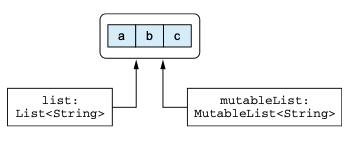
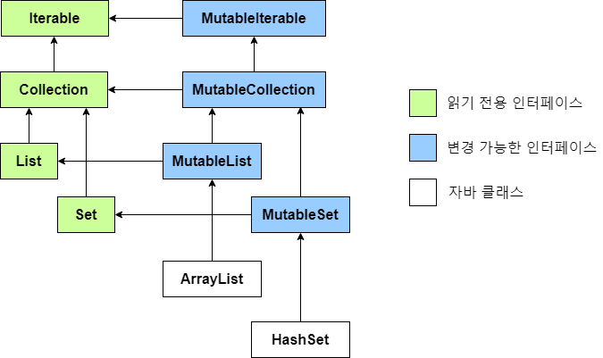

# 6.3 컬렉션과 배열

## 6.3.1 널 가능성과 컬렉션

타입 인자 뒤에 ? 붙이면 변수에 널을 저장할 수 있다는 뜻

Int? → Int 또는 Null

컬렉션 안에 널 값을 넣을 수 있는지 여부도 ?을 통해 제한이 가능하다.

1. List<Int?> = 리스트 자체는 항상 존재하며, 리스트의 각 원소는 널이 될 수 있다.
2. List<Int>? = 리스트가 null 일수는 있지만, 리스트가 참조가 존재한다면 그 원소는 전부 널 일수 없다.
3. List<Int?>? = 리스트 자체가 널 일수도 있고 리스트가 존재하더라도 그 원소 역시 널 일수 있다.

널이 될 수 있는 값으로 이뤄진 컬렉션에서 널 값을 걸러내는 경우가 자주 있어서 코틀린 표준 라이브러리는 그런 일을 하는 filterNotNull을 제공한다.

```kotlin
fun addValidNumbers(numbers: List<Int?>){

    var sumOfValidNumbers = 0
    var inValidNumbers =0

    for(number in numbers){
        if (number != null)
            sumOfValidNumbers++
    }

    println("Sum : $sumOfValidNumbers")
}

>>> Sum : 39

fun main() {

    val numbers: List<Int?> = listOf(1, 2, 3, 4, 5, null, 6, 7, 8, null)
    addValidNumbers(numbers)
}

// 리팩토링
fun addValidNumbers(numbers: List<Int?>){

    var validNumbers = numbers.filterNotNull()  // 타입이 List<Int> 이

    println("Sum : ${validNumbers.size}")
}

>>> Sum : 39
```

## 6.3.2 읽기 전용과 변경 가능한 컬렉션

**코틀린의 컬렉션과 자바의 컬렉션의 가장 중요한 차이는**

코틀린은 컬렉션 안의 **데이터에 접근하는 인터페이스**와 컬렉션 안의 **데이터를 변경하는 인터페이스**가 분리되어 있다.

kotlin.collections.Collection

- 원소에 대한 이터레이션 iterator
- 컬렉션의 크기. size
- 어떤 값이 들어있는지 검사 contains
- 컬렉션 내의 데이터를 읽는 여러 다른 연산

kotlin.collection.MutableCollection (Collection을)

- 원소에 대한 추가(add), 수정, 삭제(remove), 전부 삭제(removeAll)

**코드에서 가능하면 항상 읽기 전용 인터페이스를 사용하는 것이 일반적인 규칙으로 삼아야 된다.**

**코드가 컬렉션을 변경할 필요가 있을 때만 변경 가능한 버전을 만들어야 한다**

근데 컬렉션이 변경 불가능하면 어떻게 사용해?

컬렉션 인터페이스의 타입이 읽기 전용 컬렉션이라고 해서 꼭 변경 불가능한 컬렉션 인스턴스일 필요는 없다.



```kotlin
fun printNumbers(numbers: List<Int>) {
    // List<Int>는 읽기 전용이므로 추가나 변경 불가
    for (number in numbers) {
        println(number)
    }
}

fun main() {
    val mutableNumbers = mutableListOf(1, 2, 3)

    // 읽기 전용으로 넘겨줌
    printNumbers(mutableNumbers)

    // mutableNumbers는 여전히 변경 가능
    mutableNumbers.add(4)
    println(mutableNumbers) // [1, 2, 3, 4]
}
```

### 6.3.3 코틀린 컬렉션과 자바

코틀린 컬렉션은 자바 컬렉션 구조를 그대로 사용하였다.

따라서 코틀린과 자바 사이를 오갈 때 아무 변환도 필요없다.

하지만 코틀린의 경우 자바와는 다르게 읽기 전용 인터페이스와 변경 가능한 인터페이스로 나뉜다.



| 컬렉션 | 읽기전용 | 변경가능 |
| --- | --- | --- |
| List | listOf | mutableListOf, arrayListOf |
| Set | setOf | mutableSetOf, hashSetOf, linkedSetOf, sortedSetOf |
| Map | mapOf | mutableMapOf, hashMapOf, linkedMapOf, sortedMapOf |

그래서 만약 자바와 코틀린을 혼용해서 코드를 작성하게 되면

자바는 읽기 전용 컬렉션과 변경 가능 컬렉션을 구분하지 않으므로, 읽기 전용 컬렉션을 변경할 수 있다.

```kotlin
import java.util.List;

public class CollectionUtils {

    public static List<String> upperCaseAll(List<String> item){

        for(int i=0; i<item.size(); i++){
           item.set(i, item.get(i).toUpperCase());
        }
        item.set(0,"D");
        return item;
    }
}
```

```kotlin
fun printInUpperCase(list: List<String>){// 읽기 전용
    println(CollectionUtils.upperCaseAll(list))
}

fun main() {
    val list = listOf("a", "b", "c")
    printInUpperCase(list)
}
```

코틀린 컴파일러는 이를 막을 방법이 없다. 이러한 모든 책임은 개발자에게 존재한다.

### 6.3.4 컬렉션을 플랫폼 타입으로 다루기

플랫폼 타입이란?

플랫폼 타입은 코틀린이 **자바 코드와 상호 운용할 때** 발생한다. 자바는 기본적으로 널 가능성(nullability)에 대한 정보를 제공하지 않기 때문에, 코틀린에서 자바 API를 사용할 때 그 타입이 **널이 될 수도 있고, 널이 아닐 수도 있는 상황**을 허용하는 타입을 플랫폼 타입이라고 한다.

자바 메서드 구현을 오버 라이딩할 때 문제가 있어 오버라이드 하려는 메서드에서 자바 컬렉션 타입을 어떤 코틀린 컬렉션 타입으로 표현할지 지정해줘야한다.

컬렉션에서 플랫폼 타입을 다룰 때, 다음과 같은 질문들이 중요해진다.

1. **컬렉션 자체가 널이 될 수 있는가?**
2. **컬렉션의 원소들이 널이 될 수 있는가?**
3. **컬렉션이 변경 가능한가?**

자바

```kotlin
public interface FileContentProcessor {

    void readContents(File path, List<String> textContents);
}
```

코틀린

```kotlin
class FileIndexer: FileContentProcessor{

    override fun readContents(path: File, textContents: List<String>?) {

    }

}
```

1. **컬렉션 자체가 널이 될 수 있는가? → 빈파일일 수 있음**
2. **컬렉션의 원소들이 널이 될 수 있는가? → 파일의 내용이 있기 때문에 각 원소는 null이 안됨**
3. **컬렉션이 변경 가능한가? → 파일을 읽기만 하기 때문에 변경 불가능**

### 6.3.5 객체의 배열과 원시 타입의 배열

코틀린에서 객체의 배열과 원시타입의 배열을 생성하는 방법을 알아보자.

- 원시타입과 객체 타입

    ### **원시 타입(Primitive Types)과 객체 타입(Object Types)의 차이**

    - **원시 타입(Primitive Types)**: `int`, `boolean`, `char` 등은 **박싱되지 않은 타입**으로, 메모리 효율성을 높이기 위해 사용하는 기본 데이터 타입입니다. 자바에서 이들은 값 자체를 저장하며, 추가적인 객체 래핑이나 참조를 사용하지 않기 때문에 메모리 사용이 매우 효율적이고, 연산 속도도 빠릅니다.
    - **객체 타입(Object Types)**: `Integer`, `Boolean`, `Character`와 같은 **박싱된 타입**은 객체로 래핑되어 처리됩니다. 원시 타입과 달리, 객체 타입은 **참조**를 통해 값을 저장하며, 추가적인 메모리와 연산 비용이 발생합니다. JVM에서는 객체마다 메모리를 할당하고 가비지 컬렉션이 이를 관리해야 하기 때문에 성능 측면에서 불리할 수 있습니다.

객체 배열 생성

1) `arrayOf()`를 사용한 객체 배열 생성

객체 타입의 원소들을 넘겨주면, 해당 원소들로 배열을 생성합니다.

```kotlin
val stringArray = arrayOf("Kotlin", "Java", "Python")
```

(2) `arrayOfNulls()`를 사용한 객체 배열 생성

`arrayOfNulls`는 모든 원소가 `null`로 초기화된 배열을 생성합니다. 이 경우 배열의 타입은 **널이 가능한 타입**이 됩니다.

```kotlin
fun main() {
    val nullArray = arrayOfNulls<String>(5)
    println(nullArray.joinToString()) // null, null, null, null, null
}
```

(3) `Array()` 생성자를 사용한 객체 배열 생성

배열의 크기와 각 원소를 초기화하는 **람다 함수**를 인자로 받아 배열을 생성합니다.

```kotlin
fun main() {
    val letters = Array(26) { ('a' + it).toString() }
    println(letters.joinToString(" ")) // a b c d e ... z
}
```

원시 타입 배열 생성

주요 원시 타입 배열 클래스:

- **`IntArray`**: `int[]`에 대응하는 배열
- **`ByteArray`**: `byte[]`에 대응하는 배열
- **`CharArray`**: `char[]`에 대응하는 배열
- **`BooleanArray`**: `boolean[]`에 대응하는 배열

(1) 기본 값으로 초기화된 원시 타입 배열 생성

```kotlin
val intArray = IntArray(5)
```

(2) `intArrayOf()`와 같은 팩토리 함수 사용

```kotlin
val intArray = intArrayOf(1, 2, 3, 4, 5)
```

(3) 람다를 사용해 원소를 초기화

```kotlin
val squares = IntArray(5) { (it + 1) * (it + 1) }
```