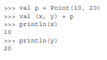
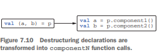

# 7.4 구조 분해 선언과 component 함수

## 구조 분해 선언
- 구조 분해 선언은 여러 값을 한꺼번에 꺼내서 사용할 수 있는 방법
- <br>
- x와 y 변수를 선언한 다음에 p의 여러 컴포넌트로 초기화

### 내부에서 구조 분해 선언은 다시 관례를 사용한다.
- 각 변수를 초기화하기 위해 componentN이라는 함수를 호출한다.
- 여기서 N은 구조 분해 선언에 있는 변수 위치에 따라 붙는 번호다. (component1, component2..)
- 위에 val(x,y)=p 는 아래와 같이 컴파일 된다.



### 데이터 타입이 아닌 클래스에서 구조 분해 선언
```kotlin
class Point(val x:Int, val y:Int){
    operator fun component1()=x
    operator fun component2()=y
}
```
- 각각 구조 분해에서 첫 번째 값과 두 번째 값을 반환하는 역할하는 함수
- `component1()`은 x 값을 반환하고 `component2()`는 y값을 반환한다.
### 구조 분해 선언을 사용해 여러 값 변환하기 
```kotlin
// data class는 데이터를 저장하고 처리하기 위한 클래스, 자동으로 component1()과 component2() 함수가 생성
data class NameComponents(val name:String, val extension:String) 

// splitFilename 함수는 파일 이름을 입력받아 이름과 확장자를 분리해주는 역할
fun splitFilename(fullName:String):NameComponents{
    // split() 함수는 문자열을 특정 기호(.)를 기준으로 두 부분으로 나눔
    val result = fullName.split('.',limit=2)
    // 함수에서 데이터 클래스의 인스턴스를 반환
    return NameComponents(result[0], result[1])
}

// 구조 분해 선언 구문을 사용해 데이터 클래스를 푼다.
val (name,ext) = splitFilename("example.kt")

println(name) //example
println(ext) //kt
```
- 구조 분해 선언은 함수에서 여러 값을 반환할 때 유용하다
- 여러 값을 한꺼번에 반환해야 하는 함수가 있다면 반환해야 하는 모든 값이 들어갈 데이터 클래스를 정의 하고 함수의 반환 타입을 그 데이터 클래스로 바꾼다. 


- 무한히 componentN을 선언할 수는 없으므로 이런 구문을 무한정 사용할 수는 없다.
    - 코틀린 표준 라이브러리에서 기본적으로 제공하는 componentN 함수는 최대 5개까지만 지원
- 컬렉션에 대한 구조 분해 선언 가능
```kotlin
val list = listOf("first", "second", "third")
// 첫 번째 두 번째 값만 꺼내기 가능
val (first, second) = list
println(first)  // 출력: first
println(second) // 출력: second
```
- 표준 라이브러리의 Pair(두 개의 값을 담음)나 Triple(세 개의 값을 담음)은 그 안에 담겨있는 원소의 의미를 말해주지 않으므로 경우에 따라 가독성이 떨어질 수 있는 반면 직접 클래스를 작성할 필요가 없으므로 코드는 더 단순
```kotlin
val pair = Pair("example", "kt")
val (name, ext) = pair // pair의 첫번 째 값이 파일이름이고 두 번째 값이 확장자라는 것을 직관적으로 알기는 어렵다. 
```
- 데이터 클래스를 직접 정의하면 코드가 더 의미를 명확히 나타낸다.
```kotlin
data class FileComponents(val name: String, val extension: String)
val (name, ext) = FileComponents("example", "kt")
=
```
  

## 7.4.1 구조 분해 선언과 루프
```kotlin
fun printEntries(map: Map<String, String>) {
    for ((key, value) in map) {
        println("$key -> $value")
    }
}

val map = mapOf("Oracle" to "Java", "JetBrains" to "Kotlin")
printEntries(map)
// Oracle -> Java
// JetBrains -> Kotlin
```
- 맵의 원소에 대해 이터레이션할 때 구조 분해 선언이 유용하다!

```kotlin
for (entry in map.entries){
    val key = entry.component1()
    val value = entry.component2()
    //...
}
```
- 자바와 달리 코틀린에서는 맵을 직접 이터레이션할 수 있다.
    - Map.Entry에 대한 확장 함수로 component1과 component2를 제공   

- 만약 구조 분해 선언을 사용하지 않으면, 각각의 데이터를 꺼내기 위해서 map.entrySet() 같은 복잡한 방법을 써야 할 것이다.
    - Kotlin은 `component1()`, `component2()`라는 특별한 함수를 사용해서 key와 value를 간단하게 꺼낼 수 있도록 도와준다. `component1()`이 key를, `component2()`가 value를 꺼내는 역할을 합니다.