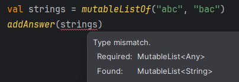
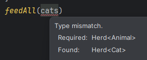
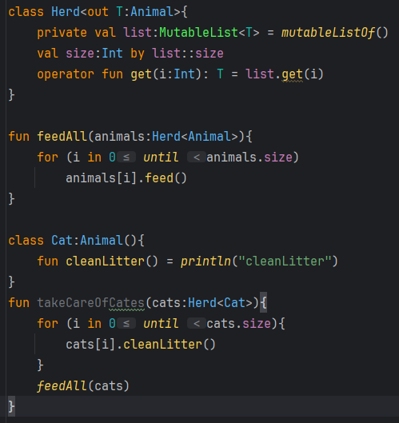
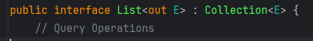
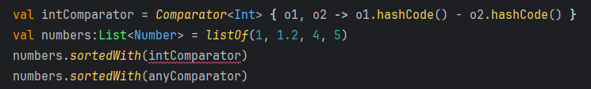
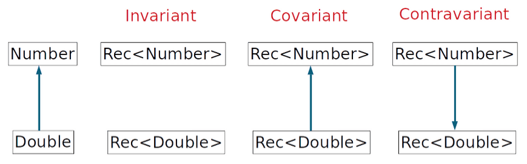
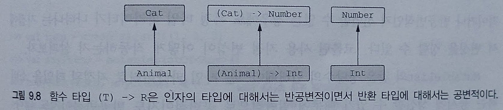
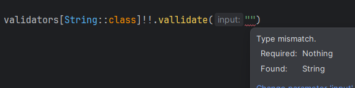
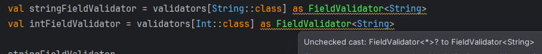

# 9.3 변성: 제네릭과 하위 타입

**변성(variance)** : 기저 타입(List)이 같고 타입 인자(String, Any...)가 다른 여러 타입이 <br>
서로 어떤 관계가 있는지 설명하는 개념

<br>

[이번 내용 잘 정리되어있는 블로그](https://jaeyeong951.medium.com/kotlin-in-n-out-variance-%EB%B3%80%EC%84%B1-69204cbf27a1)

## 9.3.1 변성이 있는 이유: 인자를 함수에 넘기기

만약 List\<Any>를 파라미터롤 받는 함수에 List\<String>을 넘기면 안전할까?
```kt
fun printContents(list:List<Any>){
    println(list.joinToString())
}

fun main() {
    printContents(listOf("abc","bac"))
}
```
위 함수는 각 원소를 Any로 취급하며 모든 문자열은 Any 타입이기도 하니 안전함
```kt
fun addAnswer(list:MutableList<Any>){
    list.add(42)
}
```


위 예제는 MuableList\<Any> 가 필요한 곳에 MuableList\<String>을 넘길 수 없다는 예시임

코틀린에서는 변경 가능성에 따라 적절한 인터페이스를 선택하면<br>
안전하지 못한 함수 호출을 막을 수 있음.<br>
함수가 읽기 전용 리스트를 받는다면 더 구체적인 타입의 원소를 갖는 리스트를 함수에 넘길 수 있음

<br>

## 9.3.2 클래스, 타입, 하위 타입

클래스와 타입은 다름<br>
제네릭 클래스가 아닌 경우에는 클래스명을 타입으로 바로 사용 가능(String ...)<br>
제네릭 클래스의 경우 List는 클래스이지 타입이 아님<br>
타입인자를 치환한 List\<Int>, List\<String> 등 이 타입이 됨

타입 사이의 관계를 알기위해 하위 타입(subtype) 개념을 잘 알아야함
> 어떤 타입 A의 값이 필요한 곳에 B타입 값을 넣어도 문제가 없다면 B 타입은 A 타입의 하위 타입임

상위 타입(supertype)은 하위 타입의 반대임

### 하위 타입 개념이 중요한 이유?
컴파일러는 변수 대입이나 함수 인자 전달시 하위 타입 검사를 매번 수행함<br>
어떤 값의 타입이 변수 타입의 하위 타입인 경우에만 값을 변수에 대입하게 허용함

<br>

간단한 경우에 하위 타입은 하위 클래스(subclass)와 근본적으로 같음

제네릭 타입의 경우에는 하위 클래스와 하위 타입의 차이가 중요해짐

제네릭 타입을 인스턴스화할 때 타입 인자로 서로 다른 타입이 들어가면 <br>
인스턴스 타입 사이의 하위 타입 관계가 성립하지 않으므로<br>
그 제네릭 타입은 **무공변(invariant)** 이라고 말함<br>
반대의 경우 **공변적(convariant)** 이라고 함

<br>

## 9.3.3 공변성: 하위 타입 관계를 유지
A가 B의 하위타입일 때 Producer\<A> 는 Producer\<B>의 하위 타입이고 Producer는 공변적임

코틀린에서 제네릭 클래스가 타입 파라미터에 대해 공변적임을 표시하려면 타입 파라미터명 앞에 ``out`` 을 붙임
```kt
interface Producer<out T> {
    fun produce() : T
}
```
타입 파라미터를 공변적으로 만들면 <br>
함수 정의에 사용한 파라미터 타입과 타입인자의 타입이 정확히 일치하지 않아도<br>
그 클래스의 인스턴스를 함수 인자나 반환값으로 사용 가능
```kt
open class Animal{
    fun feed() = println("feed~")
}
class Herd<T:Animal>{
    private val list:MutableList<T> = mutableListOf()
    val size:Int by list::size
    operator fun get(i:Int): T = list.get(i)
}

fun feedAll(animals:Herd<Animal>){
    for (i in 0 until animals.size)
        animals[i].feed()
}
```
위와 같은 상황일 때 사용자가 고양이 무리를 만들어서 관리한다고 해보자
```kt
class Cat:Animal(){
    fun cleanLitter() = println("cleanLitter")
}
fun takeCareOfCates(cats:Herd<Cat>){
    for (i in 0 until cats.size){
        cats[i].cleanLitter()
    }
    feedAll(cats)
}
```


Herd 클래스의 T 타입 파라미터에 대해 아무 변성도 지정하지 않았기 때문에 <br>
고양이 무리는 동물 무리의 하위 클래스가 아님

명시적으로 타입 캐스팅을 하면 해결할 수는 있지만 코드가 장황해지고 실수를 할 수 있음


``out``을 붙여 Herd를 공변적인 클래스로 만들면 해결됨

공변적으로 만들면 안전하지 못한 클래스도 있음<br>
타입 파라미터를 공변적으로 지정하면 클래스 내부에서 그 파라미터를 사용하는 방법을 제한함<br>
타입 안정성을 보장하기 위해 공변적 파라미터는 항상 아웃 위치(반환)에 있어야함<br>
(T 타입 값을 생산을 가능하지만 소비는 못함)

> 공변성 : 하위 타입 관계가 유지됨<br>
> 사용 제한 : T를 아웃 위치에서만 사용 가능
> <br>
> 변경 불가능한 리스트 선언 예시

MutableList 는 공변적인 클래스로 선언할 수가 없음<br>
(타입 T가 인과 아웃 위치에 동시에 쓰이기 때문)
> 생성자 파라미터는 인이나 아웃 둘 다 아님<br>
> 변성은 코드에서 위험할 여지가 있는 메서드를 호출할 수 없게 만들기 위함인데<br>
> 생성자는 인스턴스 생성 뒤 나중에 호출할 수 있는 메서드가 아니기 때문

변성 규칙은 클래스 외부의 사용자가 클래스를 잘못 사용하는 일을 막기위한 것이므로<br>
클래스 내부 구현(private)에는 인, 아웃과 같은 위치 규칙이 적용되지 않음

<br>

## 9.3.4 반공변셩: 뒤집힌 하위 타입 관계
반공변성(contravariance) : 공변성을 거울에 비친 상

반공변 클래스의 하위 타입 관계는 공변 클래스의 경우와 반대
> 타입 B 가 타입 A의 하위 타입인 경우<br>
> Comsumer\<A>가 Consumer\<B>의 하위타입인 관계가 성립하면<br>
> 제네릭 클래스 Consumer\<T>는 반공변임

```kt
val anyComparator = Comparator<Any> { o1, o2 ->  o1.hashCode() - o2.hashCode()}
val strings: List<String> = listOf("aasd","xcv", "atg", "sdg")
strings.sortedWith(anyComparator)
```
> ``sortedWith``는 Comparator\<String>을 요구하므로,<br>
> String 보다 더 일반적인 타입을 비교할 수 있는 Comparator를 넘기는 것이 안전함<br>
> => Comparator\<Any>가 Comparator\<String>의 하위 타입이라는 의미
> 

``in``이라는 키워드는 그 키워드가 붙은 타입이 이 클래스의 안으로 전달되어 메서드에 의해 소비된다는 의미임<br>
공변성의 경우와 마찬가지로 타입 파라미터의 사용을 제한함으로써 특정 하위 타입 관계에 도달할 수 있음

| 공변성 | 반공변성 | 무공변성 |
| :--- | :--- | :--- |
| Producer\<out T> | Consumer\<in T> | MutableList<T> |
| 타입 인자의 하위 타입 관계가 제네릭 타입에서도 유지됨 | 타입 인자의 하위 타입 관계가 제네릭 타입에서 뒤집힘 | 하위 타입 관계가 성립하지 않음 |
| Producer\<Cat>은 Producer\<Animal>의 하위 타입 | Consumer\<Animal>은 Consumer\<Cat>의 하위 타입 |  |
| T를 아웃 위치에서만 사용할 수 있음 | T를 인 위치에서만 사용할 수 있음 | T를 아무 위치에서나 사용할 수 있음 |



하나의 클래스나 인터페이스가 어떤 타입에 대해서는 공변적이고 다른 타입에 대해서는 반공변적일 수있음
```kt
interface Function1<in P, out R> {
    operator fun invoke(p: P): R
}
```
```
fun enumerateCats(f : (Cat) -> Number, cat:Cat) = f.invoke(cat)
fun Animal.getindex(): Int = getindex()

enumerateCats(Animal::getindex, Cat())
```


<br>

## 9.3.5 사용 지점 변성: 타입이 언급되는 지점에서 변성 지정
클래스를 선언하면서 변성을 지정하면 그 클래스를 사욛하는 모든 장소에 변성 지정자가 영향을 끼쳐 편리함<br>
=> 선언 지점 변성(declaration site variance)

자바의 와일드카드 타입(? extends, ? super)에 익숙하면 자바의 변성을 다른 방식으로 다룬다는 점을 알 수 있음<br>
자바는 타입 파라미터가 있는 타입을 사용할 때마다 <br>
해당 타입의 하위 혹은 상위타입의 대치를 허용할 것인지 명시해야함<br>
=> 사용 지점 변성(use-site variance)

코틀린도 사용지점 변성을 지원함

```kt
// 무공변 파라미터 타입 사용하는 데이터 복사 함수
fun <T> copyData(source: MutableList<T>, dest:MutableList<T>){
    source.forEach {dest.add(it)}
}
```
위 함수는 컬렉션의 원소를 다른 컬렉션으로 복사함<br>
두 컬렉션 모두 무공변 타입이지만 <br>
원본 컬렉션에서는 읽기만 하고 대상 컬렉션은 쓰기만 함<br>
이런 경우 두 원소 타입이 정확히 일치할 필요가 없음
```kt
fun <T:R, R> copyData2(source: MutableList<T>, dest:MutableList<R>){
    source.forEach {dest.add(it)}
}
```
T가 R의 하위 타입이기만 하면 아무 문제 없음
```kt
fun <T> copyData3(source: MutableList<out T>, dest:MutableList<T>){
    source.forEach {dest.add(it)}
}
```
함수 구현이 아웃 위치에 있는 타입 파라미터를 사용하는 메서드만 호출한다면<br>
그런 정보는 함수 정의 시 타입 파라미터에 변성 변경자를 추가할 수 있음

타입 선언에서 타입 파라미터를 사용하는 위치라면 어디에나 변성 변경자를 붙일 수 있음

> 위와 같은 경우에 타입 프로젝션(type projection)이 일어남<br>
> 일반적인 타입이 아니라 제약을 가한 타입으로 변경한다는 의미<br><br>
> 위 경우는 아웃 위치에 T 타입 파라미터를 사용하는 메서드만 호출할 수 있게 제한함

> 코틀린의 사용 지점 변성 선언은 자바의 한정 와일드카드와 똑같음<br>
> MutableList\<out T> == MutableList\<? extends T><br>
> MutableList\<in T> == MutableList\<? super T>

사용 지점 변성을 사용하면 타입 인자로 사용할 수 있는 타입의 범위가 넒어짐

<br>

## 9.3.6 스타 프로젝션: 타입 인자 대신 * 사용

스타 프로젝션(star projection) : 제네릭 타입 인자 정보가 없음을 나타냄
> List\<*> : 원소 타입이 알려지지 않은 리스트

#### 스타 프로젝션의 의미
- MutableList\<*> 와 MutableList<Any?>는 다름<br>
    전자는 뭔지 모르는 특정 타입만 받을 수 있지만 후자는 모두 받을 수 있음<br>
    하지만 전자에서 꺼낼 때 안전하게 꺼내기 위해 Any?로 꺼낼 수 있음<br>
    그래서 꺼내는 동작에서는 MutableList\<out Any?> 와 같다고 할 수 있음<br>
    자바와 비교하면 와일드 카드에 대응함
- 타입 인자 정보가 중요하지 않을 때 사용하기도 함<br>
    예) 타입 파리미터를 시그니처에서 전혀 언급하지 않거나, 데이터를 읽기는 하지만 타입에 관심없는 경우<br>
    ```kt
    fun printFirst(list:List<*>){
        if(list.isNotEmpty())
            println(list.first())
    }
    ```

#### 스타 프로젝션 사용법과 함정
```kt
interface FieldValidator<in T> {
    fun vallidate(input: T): Boolean
}
object DefaultStringValidator:FieldValidator<String>{
    override fun vallidate(input: String): Boolean = input.isNotEmpty()
}
object DefaultIntValidator: FieldValidator<Int> {
    override fun vallidate(input: Int): Boolean = input >= 0
}

fun main() {
    val validators = mutableMapOf<KClass<*>, FieldValidator<*>>()
    validators[String::class] = DefaultStringValidator
    validators[Int::class] = DefaultIntValidator
    
    validators[String::class]!!.vallidate("")
}
```


어떤 타입을 검증하는 검증기인지 모르기 때문에 안전하기 않다 판단하고 컴파일 오류가 남<br>
캐스팅 해서 사용은 가능 하지만 안전하지 않은 캐스팅 이라고 경고가 뜸



검증기 컬렉션에 대한 접근을 캡슐화 해서 해결할 수 있음
```kt
object Validators {
    private val validators = mutableMapOf<KClass<*>, FieldValidator<*>>()
    fun <T: Any> registerValidator(
        kclass: KClass<T>,
        fieldValidator: FieldValidator<T>){
        validators[kclass] = fieldValidator
    }

    @Suppress("UNCHECKED_CAST")
    operator fun <T: Any> get(kclass:KClass<T>): FieldValidator<T> =
        validators[kclass] as? FieldValidator<T>
            ?: throw IllegalArgumentException("No validator for ${kclass.simpleName}")
}

fun main() {
    Validators.registerValidator(String::class, DefaultStringValidator)
    Validators.registerValidator(Int::class, DefaultIntValidator)
    println(Validators[String::class].vallidate("Kotlin"))
    println(Validators[Int::class].vallidate(42))
}
```